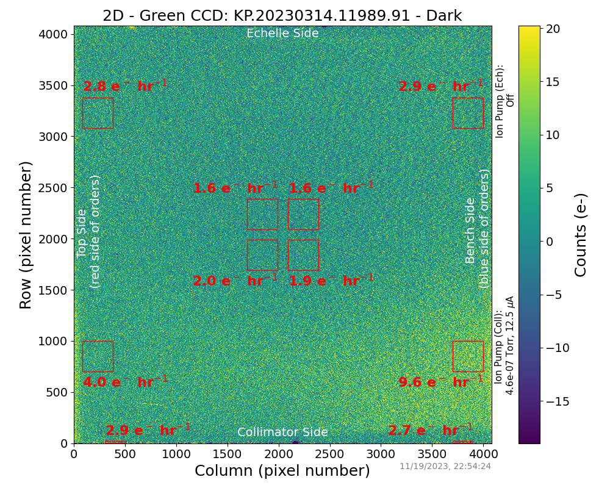
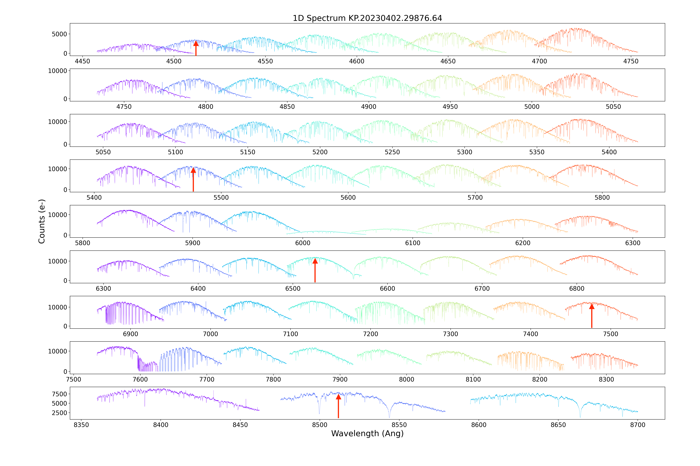

KPF Data Format
===============

Overview
--------

KPF data products are defined for these data levels:

* **Level 0 (L0)**: Raw data products produced by KPF at the W. M. Keck Observatory
* **2D**: Assembled CCD images with minimal processing.  This data product is produced by the DRP during processing from L0 to L1 but is not fundamental and is frequently not archived.
* **Level 1 (L1)**: Extracted, wavelength-calibrated spectra
* **Level 2 (L2)**: Derived data products including cross-correlation functions, radial velocities, and activity indicators.

Each of these data levels is a standardized, multi-extension FITS format, and can be read using standard fits tools (e.g., `astropy.fits.io <https://docs.astropy.org/en/stable/io/fits/>`_) and the `KPF-Pipeline <https://github.com/Keck-DataReductionPipelines/KPF-Pipeline>`_.

KPF L0 files follow the naming convention: KP.YYYYMMDD.SSSSS.ss.fits, where YYYYMMDD is a date and SSSSS.ss is the number of decimal seconds after UT midnight corresponding to the start of the exposure.  2D/L1/L2 files have similar file names, but with '_2D', '_L1', or '_L2' before '.fits'.  For example, KP.YYYYMMDD.SSSSS.ss_2D.fits is a 2D file name.

See the section titled :ref:`label-tutorials` for a set of tutorials on the various KPF data files.

In addition, the DRP is able to produce WLS Dictionaries that contain detailed diagnostic information about the fits of individual lines, orders, and orderlets for the wavelength solutions.  These are described at the bottom of this page.

Data Format of KPF Files
------------------------

L0 FITS Extensions
^^^^^^^^^^^^^^^^^^

===================  =========  ==============  =======
Extension Name       Data Type  Data Dimension  Description    
===================  =========  ==============  =======
GREEN_AMP1           image      4110 x 2094     CCD image from Green amplifier 1   
GREEN_AMP2           image      4110 x 2094     CCD image from Green amplifier 2 [a]       
RED_AMP1             image      4110 x 2094     CCD image from Red amplifier 1   
RED_AMP2             image      4110 x 2094     CCD image from Red amplifier 2    
CA_HK                image      255 x 1024      CCD image from Ca H&K Spectrometer    
EXPMETER_SCI         table      variable        Table of Exposure Meter measurements for SCI channel
EXPMETER_SKY         table      variable        Table of Exposure Meter measurements for SKY channel
TELEMETRY            table      variable        Table of telemetry measurements
SOLAR_IRRADIANCE     table      variable        Table of pyrheliometer measurements (for SoCal spectra)
GUIDER_AVG           image      512 x 640       Average image from the guide camera
GUIDER_CUBE_ORIGINS  table      variable        Table of time-series guide camera measurements            
===================  =========  ==============  =======

[a] - the example shown above is for two-amplifier mode.  When KPF is operated in fast' read mode, four amplifiers per CCD will be used and there will be a corresponding number of AMP extensions.

2D File FITS Extensions
^^^^^^^^^^^^^^^^^^^^^^^

===================  =========  ==============  =======
Extension Name       Data Type  Data Dimension  Description    
===================  =========  ==============  =======
RECEIPT              table      variable        Receipt of DRP processing
CONFIG               table      variable        Configuration parameters
GREEN_CCD            image      4080 x 4080     Assembled Green CCD image with bias/dark correction   
RED_CCD              image      4080 x 4080     Assembled Red CCD image with bias/dark correction   
CA_HK                image      255 x 1024      Same as in L0 file    
EXPMETER_SCI         table      variable        Same as in L0 file 
EXPMETER_SKY         table      variable        Same as in L0 file 
TELEMETRY            table      variable        Same as in L0 file 
SOLAR_IRRADIANCE     table      variable        Same as in L0 file 
GUIDER_AVG           image      512 x 640       Same as in L0 file 
GUIDER_CUBE_ORIGINS  table      variable        Same as in L0 file          
===================  =========  ==============  =======

L1 FITS Extensions
^^^^^^^^^^^^^^^^^^

===================  =========  ==============  =======
Extension Name       Data Type  Data Dimension  Description    
===================  =========  ==============  =======
RECEIPT              table      variable        Receipt of DRP processing
CONFIG               table      variable        Configuration parameters
TELEMETRY            table      variable        Table of telemetry measurements
GREEN_SCI_FLUX1      image      35 x 4080       1D spectra for 35 GREEN CCD orders of SCI1 orderlet
GREEN_SCI_FLUX2      image      35 x 4080       1D spectra for 35 GREEN CCD orders of SCI2 orderlet
GREEN_SCI_FLUX3      image      35 x 4080       1D spectra for 35 GREEN CCD orders of SCI3 orderlet
GREEN_SKY_FLUX       image      35 x 4080       1D spectra for 35 GREEN CCD orders of SKY orderlet
GREEN_CAL_FLUX       image      35 x 4080       1D spectra for 35 GREEN CCD orders of CAL orderlet
GREEN_SCI_VAR1       image      35 x 4080       Variance vs. pixel for GREEN_SCI_FLUX1
GREEN_SCI_VAR2       image      35 x 4080       Variance vs. pixel for GREEN_SCI_FLUX2
GREEN_SCI_VAR3       image      35 x 4080       Variance vs. pixel for GREEN_SCI_FLUX3
GREEN_SKY_VAR        image      35 x 4080       Variance vs. pixel for GREEN_SKY_FLUX
GREEN_CAL_VAR        image      35 x 4080       Variance vs. pixel for GREEN_CAL_FLUX
GREEN_SCI_WAVE1      image      35 x 4080       Wavelength vs. pixel for GREEN_SCI_FLUX1
GREEN_SCI_WAVE2      image      35 x 4080       Wavelength vs. pixel for GREEN_SCI_FLUX2
GREEN_SCI_WAVE3      image      35 x 4080       Wavelength vs. pixel for GREEN_SCI_FLUX3
GREEN_SKY_WAVE       image      35 x 4080       Wavelength vs. pixel for GREEN_SKY_FLUX
GREEN_CAL_WAVE       image      35 x 4080       Wavelength vs. pixel for GREEN_CAL_FLUX
GREEN_TELLURIC       table      n/a             Not used yet (will include telluric spectrum)
GREEN_SKY            table      n/a             Not used yet (will include modeled sky spectrum)
RED_SCI_FLUX1        image      32 x 4080       1D spectra for 32 RED CCD orders of SCI1 orderlet
RED_SCI_FLUX2        image      32 x 4080       1D spectra for 32 RED CCD orders of SCI2 orderlet
RED_SCI_FLUX3        image      32 x 4080       1D spectra for 32 RED CCD orders of SCI3 orderlet
RED_SKY_FLUX         image      32 x 4080       1D spectra for 32 RED CCD orders of SKY orderlet
RED_CAL_FLUX         image      32 x 4080       1D spectra for 32 RED CCD orders of CAL orderlet
RED_SCI_VAR1         image      32 x 4080       Variance vs. pixel for RED_SCI_FLUX1
RED_SCI_VAR2         image      32 x 4080       Variance vs. pixel for RED_SCI_FLUX2
RED_SCI_VAR3         image      32 x 4080       Variance vs. pixel for RED_SCI_FLUX3
RED_SKY_VAR          image      32 x 4080       Variance vs. pixel for RED_SCI_FLUX
RED_CAL_VAR          image      32 x 4080       Variance vs. pixel for RED_SCI_FLUX
RED_SCI_WAVE1        image      32 x 4080       Wavelength vs. pixel for RED_SCI_FLUX1
RED_SCI_WAVE2        image      32 x 4080       Wavelength vs. pixel for RED_SCI_FLUX2
RED_SCI_WAVE3        image      32 x 4080       Wavelength vs. pixel for RED_SCI_FLUX3
RED_SKY_WAVE         image      32 x 4080       Wavelength vs. pixel for RED_SKY_FLUX
RED_CAL_WAVE         image      32 x 4080       Wavelength vs. pixel for RED_CAL_FLUX
RED_TELLURIC         table      n/a             Not used yet (will include telluric spectrum)
RED_SKY              table      n/a             Not used yet (will include modeled sky spectrum)
CA_HK_SCI            image      6 x 1024        1D spectra (6 orders) of SCI in Ca H&K spectrometer
CA_HK_SKY            image      6 x 1024        1D spectra (6 orders) of SKY in Ca H&K spectrometer
CA_HK_SCI_WAVE       image      6 x 1024        Wavelength vs. pixel for CA_HK_SCI
CA_HK_SKY_WAVE       image      6 x 1024        Wavelength vs. pixel for CA_HK_SKY
BARY_CORR            table      67              Table of barycentric corrections by spectral order
===================  =========  ==============  =======

L2 FITS Extensions
^^^^^^^^^^^^^^^^^^

===================  =========  ==============  =======
Extension Name       Data Type  Data Dimension  Description    
===================  =========  ==============  =======
RECEIPT              table      variable        Receipt of DRP processing
CONFIG               table      variable        Configuration parameters
TELEMETRY            table      variable        Table of telemetry measurements
GREEN_CCF            image      5 x 52 x 804    CCFs (orderlet x order x RV step) for GREEN
RED_CCF              image      5 x 52 x 804    CCFs (orderlet x order x RV step) for RED
GREEN_CCF            image      5 x 52 x 804    Reweighted CCFs (orderlet x order x RV step) for GREEN
RED_CCF              image      5 x 52 x 804    Reweighted CCFs (orderlet x order x RV step) for RED
RV                   table      67              Table of RVs by spectral order (described below)
ACTIVITY             table      n/a             Not used yet (will include activity measurements)
===================  =========  ==============  =======

Primary Extension Header Keywords
---------------------------------

L0 Primary Extension Header
^^^^^^^^^^^^^^^^^^^^^^^^^^^

Most of the important keywords are stored in the primary extension of the Level 0 file, which is written immediately after each KPF exposure.

========  ==========================================  =========
Keyword   Value (example)                             Comment
========  ==========================================  =========
DATE-BEG  2023-10-22T15:30:01.056733                  Start of exposure from kpfexpose
DATE-MID  2023-10-22T15:32:31.065                     Halfway point of the exposure (unweighted)
DATE-END  2023-10-22T15:35:01.072797                  End of exposure
EXPTIME   300.0                                       Requested exposure time
ELAPSED   300.0                                       Actual exposure time
PROGNAME  N226                                        Program name from kpfexpose
OBJECT    42813                                       Object name
TARGRA    06:12:13.80                                 Right ascension [hr] from DCS
TARGDEC   -14:38:56.0                                 Declination [deg] from DCS
TARGEPOC  2000.0                                      Target epoch from DCS
TARGEQUI  2000.0                                      Target equinox from DCS
TARGPLAX  14.7                                        Target parallax [arcsec] from DCS
TARGPMDC  0.0                                         Target proper motion [arcsec/yr] in declination from DCS
TARGPMRA  0.0                                         Target proper motion [s/yr] in right ascension from DCS
TARGRADV  81.87                                       Target radial velocity [km/s]
TARGFRAM  FK5                                         Target frame
AIRMASS   1.26                                        Airmass from DCS
PARANTEL  23.58                                       Parallactic angle of the telescope from DCS
HA        +01:01:37.22                                Hour angle
EL        52.46                                       Elevation [deg]
AZ        204.46                                      Azimuth [deg]
LST       07:13:51.02                                 Local sidereal time
RA        06:12:13.80                                 [h] Right ascension
DEC       -14:38:56.0                                 [deg] Declination
EQUINOX   2000.0                                      DCS Equinox
MJD-OBS   60310.21291                                 Modified Julian days
GAIAID    DR3 2993561629444856960                     GAIA Target name
2MASSID   J06121397-1439002                           2MASS Target name
GAIAMAG   9.28                                        GAIA G band magnitude
2MASSMAG  8.06                                        2MASS J band magnitude
TARGTEFF  5398.0                                      Target effective temperature (K)
OCTAGON   EtalonFiber                                 Selected octagon calibration source (not necessarily powered on)
TRIGTARG  Green,Red,Ca_HK,ExpMeter,Guide              Cameras that were sent triggers
IMTYPE    Object                                      Image Type
TARGNAME  42813                                       KPF Target Name
DCSNAME   42813                                       DCS Target Name
FULLTARG  42813                                       Full Target name from kpfconfig
CAL-OBJ   None                                        Calibration fiber source
SKY-OBJ   Sky                                         Sky fiber source
SCI-OBJ   Target                                      Science fiber source
AGITSTA   Running                                     Agitator status
FIUMODE   Observing                                   FIU operating mode
FFFB      Yes                                         Flatfield fiber on
TOTCNTS   1.1299e+08 1.959e+08 1.8185e+08 1.1561e+08  Total Exp. Meter counts (DN) - four channels (445.0-551.25, 551.25-657.5, 657.5-763.75, 763.75-870.0 nm) 
TOTCORR   2.3994e+08 4.1319e+08 3.8088e+08 2.403e+08  Total Exp. Meter counts (DN), corrected for dead time - four channels (445.0-551.25, 551.25-657.5, 657.5-763.75, 763.75-870.0 nm) 
ETAV1C1T  23.990154                                   Etalon Vescent 1 Channel 1 temperature
ETAV1C2T  23.79949                                    Etalon Vescent 1 Channel 2 temperature
ETAV1C3T  23.599987                                   Etalon Vescent 1 Channel 3 temperature
ETAV1C4T  23.900118                                   Etalon Vescent 1 Channel 4 temperature
ETAV2C3T  24.000668                                   Etalon Vescent 2 Channel 3 temperature
PTHDAY    1.422E-05                                   Last ThAr Daily power meter measurement (Watts)
PTHAU     1.422E-05                                   Last ThAr Gold power meter measurement (Watts)
PUDAY     1.422E-05                                   Last UNe Daily power meter measurement (Watts)
PUAU      1.422E-05                                   Last UNe Gold power meter measurement (Watts)
PLFC      1.422E-05                                   Last LFC power meter measurement (Watts)
PETAL     1.422E-05                                   Last Etalon power meter measurement (Watts)
PBRB      1.422E-05                                   Last Broadband power meter measurement (Watts)
PSOL      1.422E-05                                   Last SoCal-CalFib power meter measurement (Watts)
PTHDAYT   '20250108T08:37:44 HST'                     Time of last ThAr Daily power measurement
PTHAUT    '20250108T08:37:44 HST'                     Time of last ThAr Gold power measurement
PUDAYT    '20250108T08:37:44 HST'                     Time of last UNe Daily power measurement
PUAUT     '20250108T08:37:44 HST'                     Time of last UNe Gold power measurement
PLFCT     '20250108T08:37:44 HST'                     Time of last LFC power measurement
PETALT    '20250108T08:37:44 HST'                     Time of last Etalon power measurement
PBRBT     '20250108T08:37:44 HST'                     Time of last Broadband power measurement
PSOLT     '20250108T08:37:44 HST'                     Time of last SoCal-CalFib power measurement
TIMEERR   'ok 2 3 {NTP time correct to within 3 ms}'  NTP time server response (needs interpretation)
VIGNETTE  'false '                                    Dome vignetting (true/false)
STVIGNE   'false '                                    Top shutter vignetting (true/false)
SBVIGNE   'false '                                    Bottom shutter vignetting (true/false)
SBELEV    23.99                                       Bottom shutter elevation (deg)
STELEV    23.99                                       Top shutter elevation (deg)
========  ==========================================  =========

2D Primary Extension Header
^^^^^^^^^^^^^^^^^^^^^^^^^^^

The 2D file inherits all L0 keywords.  Below are additional keywords.

========  ==========================================  =========
Keyword   Value (example)                             Comment
========  ==========================================  =========
DRPTAG2D  v2.5.2                                      Git version number of KPF-Pipeline used to make 2D
DRPHSH2D  'ccf5f6ebe0c9ae7d43706cc57fed2ecdeb540a17'  Git commit hash version of KPF-Pipeline used to make 2D
NOTJUNK   1                                           QC: 1 = not in the list of junk files check; this QC is rerun on L1 and L2
DATAPRL0  1                                           QC: 1 = L0 data products present with non-zero array sizes
KWRDPRL0  1                                           QC: 1 = L0 expected keywords present 
TIMCHKL0  1                                           QC: 1 = consistent times in L0 file
EMSAT     1                                           QC: 1 = Exp Meter not saturated; 0 = 2+ reduced EM pixels within 90% of saturation in EM-SCI or EM-SKY 
EMNEG     1                                           QC: 1 = Exp Meter not negative flux; 0 = 20+ consecutive pixels in summed spectra with negative flux 
DATAPR2D  1                                           QC: 1 = 2D data products present with non-zero array sizes
CAHKPR2D  1                                           QC: 1 = 2D CaHK data present with non-zero array sizes
GOODREAD  1                                           QC: 1 = Exposure time not consistent with CCD readout error (~6 sec)
POS2DSNR  1                                           QC: 1 = 2D Red and Green SNR (data/var^0.5) not significantly negative
LOWBIAS   1                                           QC: 1 = 2D bias flux not low
LOWDARK   1                                           QC: 1 = 2D dark flux not low
LFC2DFOK  1                                           QC: 1 = LFC flux meets threshold of 4000 counts
OLDBIAS   1                                           QC: 1 = Master bias within 5 days of this obs
OLDDARK   1                                           QC: 1 = Master dark within 5 days of this obs
OLDFLAT   1                                           QC: 1 = Master flat within 5 days of this obs
NTPGOOD   1                                           QC: 1 = NTP time within 100 ms
GUIDGOOD  1                                           QC: 1 = Guider RMS and bias within 50 mas RMS
TARGPLAU  1                                           QC: 1 = TARG kwds present with plausible values
RNGREEN1  4.85283                                     Read noise for GREEN_AMP1 [e-] (first amplifier region on Green CCD)
RNGREEN2  4.14966                                     Read noise for GREEN_AMP2 [e-] (second amplifier region on Green CCD)
RNGREEN3  4.85283                                     Read noise for GREEN_AMP3 [e-] (third amplifier region on Green CCD)
RNGREEN4  4.14966                                     Read noise for GREEN_AMP4 [e-] (fourth amplifier region on Green CCD)
RNRED1    4.0376                                      Read noise for RED_AMP1 [e-] (first amplifier region on Red CCD)
RNRED2    4.12717                                     Read noise for RED_AMP2 [e-] (second amplifier region on Red CCD)
RNRED3    4.0376                                      Read noise for RED_AMP3 [e-] (third amplifier region on Red CCD)
RNRED4    4.12717                                     Read noise for RED_AMP4 [e-] (fourth amplifier region on Red CCD)
GREENTRT  46.804                                      Green CCD read time [sec]
REDTRT    46.839                                      Red CCD read time [sec]
READSPED  'regular '                                  Categorization of CCD read speed ('regular' or 'fast')
FLXREG1G  1.00                                        Dark current [e-/hr] - Green CCD region 1 - coords = [1690:1990,1690:1990]
FLXREG2G  1.00                                        Dark current [e-/hr] - Green CCD region 2 - coords = [1690:1990,2090:2390]
FLXREG3G  1.00                                        Dark current [e-/hr] - Green CCD region 3 - coords = [2090:2390,1690:1990]
FLXREG4G  1.00                                        Dark current [e-/hr] - Green CCD region 4 - coords = [2090:2390,2090:2390]
FLXREG5G  1.00                                        Dark current [e-/hr] - Green CCD region 5 - coords = [80:380,3080:3380]
FLXREG6G  1.00                                        Dark current [e-/hr] - Green CCD region 6 - coords = [1690:1990,1690:1990]
FLXAMP1G  1.00                                        Dark current [e-/hr] - Green CCD amplifier region 1 - coords = [3700:4000,700:1000]
FLXAMP2G  1.00                                        Dark current [e-/hr] - Green CCD amplifier region 2 - coords = [3700:4000,3080:3380]
FLXCOLLG  1.00                                        Dark current [e-/hr] - Green CCD collimator-side region = [3700:4000,700:1000]
FLXECHG   1.00                                        Dark current [e-/hr] - Green CCD echelle-side region = [3700:4000,700:1000]
FLXREG1R  1.00                                        Dark current [e-/hr] - Red CCD region 1 - coords = [1690:1990,1690:1990]
FLXREG2R  1.00                                        Dark current [e-/hr] - Red CCD region 2 - coords = [1690:1990,2090:2390]
FLXREG3R  1.00                                        Dark current [e-/hr] - Red CCD region 3 - coords = [2090:2390,1690:1990]
FLXREG4R  1.00                                        Dark current [e-/hr] - Red CCD region 4 - coords = [2090:2390,2090:2390]
FLXREG5R  1.00                                        Dark current [e-/hr] - Red CCD region 5 - coords = [80:380,3080:3380]
FLXREG6R  1.00                                        Dark current [e-/hr] - Red CCD region 6 - coords = [1690:1990,1690:1990]
FLXAMP1R  1.00                                        Dark current [e-/hr] - Red CCD amplifier region 1 = [3700:4000,700:1000]
FLXAMP2R  1.00                                        Dark current [e-/hr] - Red CCD amplifier region 2 = [3700:4000,3080:3380]
FLXCOLLR  1.00                                        Dark current [e-/hr] - Red CCD collimator-side region = [3700:4000,700:1000]
FLXECHR   1.00                                        Dark current [e-/hr] - Red CCD echelle-side region = [3700:4000,700:1000]
GDRXRMS   10.123                                      x-coordinate RMS guiding error in milliarcsec (mas)
GDRYRMS   10.123                                      y-coordinate RMS guiding error in milliarcsec (mas)
GDRRRMS   10.123                                      r-coordinate RMS guiding error in milliarcsec (mas)
GDRXBIAS  0.0010                                      x-coordinate bias guiding error in milliarcsec (mas)
GDRYBIAS  0.0010                                      y-coordinate bias guiding error in milliarcsec (mas)
GDRSEEJZ  0.450                                       Seeing (arcsec) in J+Z-band from Moffat func fit
GDRSEEV   0.450                                       Scaled seeing (arcsec) in V-band from J+Z-band
MOONSEP   55.0                                        Separation between Moon and target star (deg)
SUNALT    -45.0                                       Altitude of Sun (deg); negative = below horizon
MEDGRN1   3.9642348e+07                               Median for GREEN_AMP1 [DN] (includes overscan region, excludes NaNs explicitly)
P16GRN1   3.9340188e+07                               16th-percentile for GREEN_AMP1 [DN] (includes overscan region, excludes NaNs explicitly)
P84GRN1   3.9340188e+07                               84th-percentile for GREEN_AMP1 [DN] (includes overscan region, excludes NaNs explicitly)
MEDGRN2   3.9642348e+07                               Median for GREEN_AMP2 [DN] (includes overscan region, excludes NaNs explicitly)
P16GRN2   3.9340188e+07                               16th-percentile for GREEN_AMP2 [DN] (includes overscan region, excludes NaNs explicitly)
P84GRN2   3.9340188e+07                               84th-percentile for GREEN_AMP2 [DN] (includes overscan region, excludes NaNs explicitly)
MEDGRN3   3.9642348e+07                               Median for GREEN_AMP3 [DN] (includes overscan region, excludes NaNs explicitly)
P16GRN3   3.9340188e+07                               16th-percentile for GREEN_AMP3 [DN] (includes overscan region, excludes NaNs explicitly)
P84GRN3   3.9340188e+07                               84th-percentile for GREEN_AMP3 [DN] (includes overscan region, excludes NaNs explicitly)
MEDGRN4   3.9642348e+07                               Median for GREEN_AMP4 [DN] (includes overscan region, excludes NaNs explicitly)
P16GRN4   3.9340188e+07                               16th-percentile for GREEN_AMP4 [DN] (includes overscan region, excludes NaNs explicitly)
P84GRN4   3.9340188e+07                               84th-percentile for GREEN_AMP4 [DN] (includes overscan region, excludes NaNs explicitly)
MEDRED1   3.9642348e+07                               Median for RED_AMP1 [DN] (includes overscan region, excludes NaNs explicitly)
P16RED1   3.9340188e+07                               16th-percentile for RED_AMP1 [DN] (includes overscan region, excludes NaNs explicitly)
P84RED1   3.9340188e+07                               84th-percentile for RED_AMP1 [DN] (includes overscan region, excludes NaNs explicitly)
MEDRED2   3.9642348e+07                               Median for RED_AMP2 [e-] (includes overscan region, excludes NaNs explicitly)
P16RED2   3.9340188e+07                               16th-percentile for RED_AMP2 [DN] (includes overscan region, excludes NaNs explicitly)
P84RED2   3.9340188e+07                               84th-percentile for RED_AMP2 [DN] (includes overscan region, excludes NaNs explicitly)
MEDCAHK   3.9642348e+07                               Median for CA_HK_AMP [DN] (includes overscan region, excludes NaNs explicitly)
P16CAHK   3.9340188e+07                               16th-percentile for CA_HK_AMP [DN] (includes overscan region, excludes NaNs explicitly)
P84CAHK   3.9340188e+07                               84th-percentile for CA_HK_AMP [DN] (includes overscan region, excludes NaNs explicitly)
GR2DF99P  30552.46                                    99th percentile flux in 2D Green image (e-)
GR2DF90P  14860.21                                    90th percentile flux in 2D Green image (e-)
GR2DF50P  234.62                                      50th percentile flux in 2D Green image (e-)
GR2DF10P  42.05                                       10th percentile flux in 2D Green image (e-)
RD2DF99P  62520.97                                    99th percentile flux in 2D Red image (e-)
RD2DF90P  40589.16                                    90th percentile flux in 2D Red image (e-)
RD2DF50P  613.23                                      50th percentile flux in 2D Red image (e-)
RD2DF10P  128.83                                      10th percentile flux in 2D Red image (e-)
HK2DF99P  62520.97                                    99th percentile flux in the 2D header (e-)
HK2DF90P  40589.16                                    90th percentile flux in the 2D header (e-)
HK2DF50P  613.23                                      50th percentile flux in the 2D header (e-)
HK2DF10P  128.83                                      10th percentile flux in the 2D header (e-)
AGEBIAS   0                                           Age of master bias file compared to this file (whole days)
AGEDARK   0                                           Age of master dark file compared to this file (whole days)
AGEFLAT   0                                           Age of master flat file compared to this file (whole days)
XDSPDYG1  -15.93355                                   Green cross-dispersion offset [pix] compared to master reference
XDSPDYR1  -15.86130                                   Red cross-dispersion offset [pix] compared to master reference
XDSPDYG2  0.02673                                     Green cross-dispersion offset [pix] compared to reference in era
XDSPDYR2  0.05026                                     Red cross-dispersion offset [pix] compared to reference in era
XDSPSYG1  0.00133                                     Uncertainty [pix] in XDSPDYG1
XDSPSYR1  0.00217                                     Uncertainty [pix] in XDSPDYR1
XDSPSYG2  0.00144                                     Uncertainty [pix] in XDSPDYG2
XDSPSYR2  0.00058                                     Uncertainty [pix] in XDSPDYR2
========  ==========================================  =========

Keywords related to read noise are only computed for the amplifiers used.  In regular read mode, two amplifiers are used (AMP1 and AMP2), while in fast read mode, four amplifiers are used (AMP1, AMP2, AMP3, and AMP4).

Keywords related to dark current (starting with FLX) are only added for 2D files of Dark observations (no illumination and exposure time > 0). The regions for those keywords refer to the CCD coordinates where the dark current measurements were made (using modules/quicklook/arc/analyze_2d.py).  The image below (click to enlarge) shows the regions and dark current estimates for a 2D spectrum taken when the dark current was high.

Keywords related to the Guider are only added for 2D files that have Guider data products.  Similar for Exposure Meter data products.

Keywords related to L0 amplifier-image statistics (e.g., MEDGRN1) are only added to 2D files.  A robust estimator of data dispersion width is
sigma = 0.5 * (P84 - P16), equivalent to one standard deviation for normally distributed data.

L1 Primary Extension Header
^^^^^^^^^^^^^^^^^^^^^^^^^^^

The L1 file inherits all L0 and 2D keywords.  Below are additional important keywords.

========  =======================================================================  =========
Keyword   Value (example)                                                          Comment
========  =======================================================================  =========
DRPTAGL1  v2.5.2                                                                   Git version number of KPF-Pipeline used to make L1
DRPHSHL1  'ccf5f6ebe0c9ae7d43706cc57fed2ecdeb540a17'                               Git commit hash version of KPF-Pipeline used to make L1
WLSFILE   /masters/20231230/kpf_20231230_master_WLS_autocal-lfc-all-eve_L1.fits    First wavelength interpolation reference for this L1 file
WLSFILE2  /masters/20231231/kpf_20231231_master_WLS_autocal-lfc-all-morn_L1.fits   Second wavelength interpolation reference for this L1 file
MONOTWLS  1                                                                        QC: 1 = L1 wavelength solution is monotonic
DATAPRL1  1                                                                        QC: 1 = L1 red and green data present
CAHKPRL1  1                                                                        QC: 1 = CaHK data present in L1 with expected shape
WLSL1     1                                                                        QC: 1 = L1 WLS file check passed
LFCSAT    1                                                                        QC: 1 = L1 LFC spectrum not saturated
OLDWLS    1                                                                        QC: 1 = WLSFILE within 2 days of this obs
OLDWLS2   1                                                                        QC: 1 = WLSFILE2 within 2 days of this obs
FLATSNR   1                                                                        QC: 1 = SNR of flat greater minimum threshold and less than maximum threshold
LFCLINES  1                                                                        QC: 1 = Number and distribution of LFC lines above threshold ampltidue is sufficient for all orders/orderlets available
ETALINES  1                                                                        QC: 1 = Number and distribution of Etalon lines above threshold ampltidue is sufficient for all orders/orderlets available
WILDWSCI  1                                                                        QC: 1 = SCI WLS not wild (stdev compared to reference < 5 pixels)
WILDWSKY  1                                                                        QC: 1 = SKY WLS not wild (stdev compared to reference < 5 pixels)
WILDWCAL  1                                                                        QC: 1 = CAL WLS not wild (stdev compared to reference < 5 pixels)
SNRSC452  250.0                                                                    SNR of L1 SCI spectrum (SCI1+SCI2+SCI3; 95th %ile) near 452 nm (second bluest order); on Green CCD
SNRSK452  250.0                                                                    SNR of L1 SKY spectrum (95th %ile) near 452 nm (second bluest order); on Green CCD
SNRCL452  250.0                                                                    SNR of L1 CAL spectrum (95th %ile) near 452 nm (second bluest order); on Green CCD
SNRSC548  250.0                                                                    SNR of L1 SCI spectrum (SCI1+SCI2+SCI3; 95th %ile) near 548 nm; on Green CCD
SNRSK548  250.0                                                                    SNR of L1 SKY spectrum (95th %ile) near 548 nm; on Green CCD
SNRCL548  250.0                                                                    SNR of L1 CAL spectrum (95th %ile) near 548 nm; on Green CCD
SNRSC652  250.0                                                                    SNR of L1 SCI spectrum (SCI1+SCI2+SCI3; 95th %ile) near 652 nm; on Red CCD
SNRSK652  250.0                                                                    SNR of L1 SKY spectrum (95th %ile) near 652 nm; on Red CCD
SNRCL652  250.0                                                                    SNR of L1 CAL spectrum (95th %ile) near 652 nm; on Red CCD
SNRSC747  250.0                                                                    SNR of L1 SCI spectrum (SCI1+SCI2+SCI3; 95th %ile) near 747 nm; on Red CCD
SNRSK747  250.0                                                                    SNR of L1 SKY spectrum (95th %ile) near 747 nm; on Red CCD
SNRCL747  250.0                                                                    SNR of L1 CAL spectrum (95th %ile) near 747 nm; on Red CCD
SNRSC852  250.0                                                                    SNR of L1 SCI (SCI1+SCI2+SCI3; 95th %ile) near 852 nm (second reddest order); on Red CCD
SNRSK852  250.0                                                                    SNR of L1 SKY spectrum (95th %ile) near 852 nm (second reddest order); on Red CCD
SNRCL852  250.0                                                                    SNR of L1 CAL spectrum (95th %ile) near 852 nm (second reddest order); on Red CCD
FR452652  1.2345                                                                   Peak flux ratio between orders (452nm/652nm) using SCI2
FR548652  1.2345                                                                   Peak flux ratio between orders (548nm/652nm) using SCI2
FR747652  1.2345                                                                   Peak flux ratio between orders (747nm/652nm) using SCI2
FR852652  1.2345                                                                   Peak flux ratio between orders (852nm/652nm) using SCI2
FR12M452  0.9000                                                                   median(SCI1/SCI2) flux ratio near 452 nm; on Green CCD
FR12U452  0.0010                                                                   uncertainty on the median(SCI1/SCI2) flux ratio near 452 nm; on Green CCD
FR32M452  0.9000                                                                   median(SCI3/SCI2) flux ratio near 452 nm; on Green CCD
FR32U452  0.0010                                                                   uncertainty on the median(SCI1/SCI2) flux ratio near 452 nm; on Green CCD
FRS2M452  0.9000                                                                   median(SKY/SCI2) flux ratio near 452 nm; on Green CCD
FRS2U452  0.0010                                                                   uncertainty on the median(SKY/SCI2) flux ratio near 452 nm; on Green CCD
FRC2M452  0.9000                                                                   median(CAL/SCI2) flux ratio near 452 nm; on Green CCD
FRC2U452  0.0010                                                                   uncertainty on the median(CAL/SCI2) flux ratio near 452 nm; on Green CCD
FR12M548  0.9000                                                                   median(SCI1/SCI2) flux ratio near 548 nm; on Green CCD
FR12U548  0.0010                                                                   uncertainty on the median(SCI1/SCI2) flux ratio near 548 nm; on Green CCD
FR32M548  0.9000                                                                   median(SCI3/SCI2) flux ratio near 548 nm; on Green CCD
FR32U548  0.0010                                                                   uncertainty on the median(SCI1/SCI2) flux ratio near 548 nm; on Green CCD
FRS2M548  0.9000                                                                   median(SKY/SCI2) flux ratio near 548 nm; on Green CCD
FRS2U548  0.0010                                                                   uncertainty on the median(SKY/SCI2) flux ratio near 548 nm; on Green CCD
FRC2M548  0.9000                                                                   median(CAL/SCI2) flux ratio near 548 nm; on Green CCD
FRC2U548  0.0010                                                                   uncertainty on the median(CAL/SCI2) flux ratio near 548 nm; on Green CCD
FR12M652  0.9000                                                                   median(SCI1/SCI2) flux ratio near 652 nm; on Red CCD
FR12U652  0.0010                                                                   uncertainty on the median(SCI1/SCI2) flux ratio near 652 nm; on Red CCD
FR32M652  0.9000                                                                   median(SCI3/SCI2) flux ratio near 652 nm; on Red CCD
FR32U652  0.0010                                                                   uncertainty on the median(SCI1/SCI2) flux ratio near 652 nm; on Red CCD
FRS2M652  0.9000                                                                   median(SKY/SCI2) flux ratio near 652 nm; on Red CCD
FRS2U652  0.0010                                                                   uncertainty on the median(SKY/SCI2) flux ratio near 652 nm; on Red CCD
FRC2M652  0.9000                                                                   median(CAL/SCI2) flux ratio near 652 nm; on Red CCD
FRC2U652  0.0010                                                                   uncertainty on the median(CAL/SCI2) flux ratio near 652 nm; on Red CCD
FR12M747  0.9000                                                                   median(SCI1/SCI2) flux ratio near 747 nm; on Red CCD
FR12U747  0.0010                                                                   uncertainty on the median(SCI1/SCI2) flux ratio near 747 nm; on Red CCD
FR32M747  0.9000                                                                   median(SCI3/SCI2) flux ratio near 747 nm; on Red CCD
FR32U747  0.0010                                                                   uncertainty on the median(SCI1/SCI2) flux ratio near 747 nm; on Red CCD
FRS2M747  0.9000                                                                   median(SKY/SCI2) flux ratio near 747 nm; on Red CCD
FRS2U747  0.0010                                                                   uncertainty on the median(SKY/SCI2) flux ratio near 747 nm; on Red CCD
FRC2M747  0.9000                                                                   median(CAL/SCI2) flux ratio near 747 nm; on Red CCD
FRC2U747  0.0010                                                                   uncertainty on the median(CAL/SCI2) flux ratio near 747 nm; on Red CCD
FR12M852  0.9000                                                                   median(SCI1/SCI2) flux ratio near 852 nm; on Red CCD
FR12U852  0.0010                                                                   uncertainty on the median(SCI1/SCI2) flux ratio near 852 nm; on Red CCD
FR32M852  0.9000                                                                   median(SCI3/SCI2) flux ratio near 852 nm; on Red CCD
FR32U852  0.0010                                                                   uncertainty on the median(SCI1/SCI2) flux ratio near 852 nm; on Red CCD
FRS2M852  0.9000                                                                   median(SKY/SCI2) flux ratio near 852 nm; on Red CCD
FRS2U852  0.0010                                                                   uncertainty on the median(SKY/SCI2) flux ratio near 852 nm; on Red CCD
FRC2M852  0.9000                                                                   median(CAL/SCI2) flux ratio near 852 nm; on Red CCD
FRC2U852  0.0010                                                                   uncertainty on the median(CAL/SCI2) flux ratio near 852 nm; on Red CCD
SKYSCIMS  0.0000123                                                                SKY/SCI flux ratio in main spectrometer scaled from EM data. 
EMSCCT48  100000000.1234                                                           cumulative EM counts [ADU] in SCI in 445-870 nm
EMSCCT45  100000000.1234                                                           cumulative EM counts [ADU] in SCI in 445-551 nm
EMSCCT56  100000000.1234                                                           cumulative EM counts [ADU] in SCI in 551-658 nm
EMSCCT67  100000000.1234                                                           cumulative EM counts [ADU] in SCI in 658-764 nm
EMSCCT78  100000000.1234                                                           cumulative EM counts [ADU] in SCI in 764-870 nm
EMSKCT48  100000000.1234                                                           cumulative EM counts [ADU] in SKY in 445-870 nm
EMSKCT45  100000000.1234                                                           cumulative EM counts [ADU] in SKY in 445-551 nm
EMSKCT56  100000000.1234                                                           cumulative EM counts [ADU] in SKY in 551-658 nm
EMSKCT67  100000000.1234                                                           cumulative EM counts [ADU] in SKY in 658-764 nm
EMSKCT78  100000000.1234                                                           cumulative EM counts [ADU] in SKY in 764-870 nm
LFCLGS0   0                                                                        Min SCI Green order with good LFC lines
LFCLGS1   34                                                                       Max SCI Green order with good LFC lines
LFCLGC0   0                                                                        Min CAL Green order with good LFC lines
LFCLGC1   34                                                                       Max CAL Green order with good LFC lines
LFCLGK0   0                                                                        Min SKY Green order with good LFC lines
LFCLGK1   34                                                                       Max SKY Green order with good LFC lines
LFCLRS0   0                                                                        Min SCI Red order with good LFC lines
LFCLRS1   31                                                                       Max SCI Red order with good LFC lines
LFCLRC0   0                                                                        Min CAL Red order with good LFC lines
LFCLRC1   31                                                                       Max CAL Red order with good LFC lines
LFCLRK0   0                                                                        Min SKY Red order with good LFC lines
LFCLRK1   31                                                                       Max SKY Red order with good LFC lines
ETALGS0   0                                                                        Min SCI Green order with good Etalon lines
ETALGS1   34                                                                       Max SCI Green order with good Etalon lines
ETALGC0   0                                                                        Min CAL Green order with good Etalon lines
ETALGC1   34                                                                       Max CAL Green order with good Etalon lines
ETALGK0   0                                                                        Min SKY Green order with good Etalon lines
ETALGK1   34                                                                       Max SKY Green order with good Etalon lines
ETALRS0   0                                                                        Min SCI Red order with good Etalon lines
ETALRS1   31                                                                       Max SCI Red order with good Etalon lines
ETALRC0   0                                                                        Min CAL Red order with good Etalon lines
ETALRC1   31                                                                       Max CAL Red order with good Etalon lines
ETALRK0   0                                                                        Min SKY Red order with good Etalon lines
ETALRK1   31                                                                       Max SKY Red order with good Etalon lines
AGEWLS    -0.2205656666666667                                                      Approx age of WLSFILE compared to this file (days)
AGEWLS2   0.14193433333333330                                                      Approx age of WLSFILE2 compared to this file (days)
STATWREF  /data/reference_fits/430LFCWLS.fits                                      filename of ref for median/stdev(WLS-ref)
MEDWGS00  0.09425503797584399                                                      median(WLS-ref) [pix], Green SCI order 00       
MEDWGS01  0.08849442069640202                                                      median(WLS-ref) [pix], Green SCI order 01       
MEDWGS02  0.08371697673720710                                                      median(WLS-ref) [pix], Green SCI order 02       
MEDWGS03  0.07230817847702598                                                      median(WLS-ref) [pix], Green SCI order 03       
MEDWGS04  0.07193348907142433                                                      median(WLS-ref) [pix], Green SCI order 04       
MEDWGS05  0.06293971912283422                                                      median(WLS-ref) [pix], Green SCI order 05       
MEDWGS06  0.05077530529576392                                                      median(WLS-ref) [pix], Green SCI order 06       
MEDWGS07  0.04623384357483791                                                      median(WLS-ref) [pix], Green SCI order 07       
MEDWGS08  0.04122733863942630                                                      median(WLS-ref) [pix], Green SCI order 08       
MEDWGS09  0.04133073040155002                                                      median(WLS-ref) [pix], Green SCI order 09       
MEDWGS10  0.04083729926838733                                                      median(WLS-ref) [pix], Green SCI order 10       
MEDWGS11  0.04227960238675732                                                      median(WLS-ref) [pix], Green SCI order 11       
MEDWGS12  0.08484872198316575                                                      median(WLS-ref) [pix], Green SCI order 12       
MEDWGS13  0.08393586844081193                                                      median(WLS-ref) [pix], Green SCI order 13       
MEDWGS14  0.08276874070896721                                                      median(WLS-ref) [pix], Green SCI order 14       
MEDWGS15  0.08521370837150342                                                      median(WLS-ref) [pix], Green SCI order 15       
MEDWGS16  0.08327132770466454                                                      median(WLS-ref) [pix], Green SCI order 16       
MEDWGS17  0.08582583111034116                                                      median(WLS-ref) [pix], Green SCI order 17       
MEDWGS18  0.08304781196470204                                                      median(WLS-ref) [pix], Green SCI order 18       
MEDWGS19  0.08315949296736645                                                      median(WLS-ref) [pix], Green SCI order 19       
MEDWGS20  0.01080036766826940                                                      median(WLS-ref) [pix], Green SCI order 20       
MEDWGS21  0.00971051734467042                                                      median(WLS-ref) [pix], Green SCI order 21       
MEDWGS22  0.01159860516701642                                                      median(WLS-ref) [pix], Green SCI order 22       
MEDWGS23  0.01184356604724085                                                      median(WLS-ref) [pix], Green SCI order 23       
MEDWGS24  0.01154525605513285                                                      median(WLS-ref) [pix], Green SCI order 24       
MEDWGS25  0.01147245109164928                                                      median(WLS-ref) [pix], Green SCI order 25       
MEDWGS26  0.01092980897956587                                                      median(WLS-ref) [pix], Green SCI order 26       
MEDWGS27  0.01147811995537022                                                      median(WLS-ref) [pix], Green SCI order 27       
MEDWGS28  0.01290072360591021                                                      median(WLS-ref) [pix], Green SCI order 28       
MEDWGS29  0.01082521041557961                                                      median(WLS-ref) [pix], Green SCI order 29       
MEDWGS30  0.01187839614600258                                                      median(WLS-ref) [pix], Green SCI order 30       
MEDWGS31  0.01217203007446422                                                      median(WLS-ref) [pix], Green SCI order 31       
MEDWGS32  0.01114056458430155                                                      median(WLS-ref) [pix], Green SCI order 32       
MEDWGS33  0.01028957107757591                                                      median(WLS-ref) [pix], Green SCI order 33       
MEDWGS34  0.01339571095931450                                                      median(WLS-ref) [pix], Green SCI order 34       
MEDWGK00                    0                                                      median(WLS-ref) [pix], Green SKY order 00       
MEDWGK01                    0                                                      median(WLS-ref) [pix], Green SKY order 01       
MEDWGK02                    0                                                      median(WLS-ref) [pix], Green SKY order 02       
MEDWGK03                    0                                                      median(WLS-ref) [pix], Green SKY order 03       
MEDWGK04                    0                                                      median(WLS-ref) [pix], Green SKY order 04       
MEDWGK05                    0                                                      median(WLS-ref) [pix], Green SKY order 05       
MEDWGK06                    0                                                      median(WLS-ref) [pix], Green SKY order 06       
MEDWGK07                    0                                                      median(WLS-ref) [pix], Green SKY order 07       
MEDWGK08                    0                                                      median(WLS-ref) [pix], Green SKY order 08       
MEDWGK09                    0                                                      median(WLS-ref) [pix], Green SKY order 09       
MEDWGK10                    0                                                      median(WLS-ref) [pix], Green SKY order 10       
MEDWGK11                    0                                                      median(WLS-ref) [pix], Green SKY order 11       
MEDWGK12                    0                                                      median(WLS-ref) [pix], Green SKY order 12       
MEDWGK13                    0                                                      median(WLS-ref) [pix], Green SKY order 13       
MEDWGK14                    0                                                      median(WLS-ref) [pix], Green SKY order 14       
MEDWGK15                    0                                                      median(WLS-ref) [pix], Green SKY order 15       
MEDWGK16                    0                                                      median(WLS-ref) [pix], Green SKY order 16       
MEDWGK17                    0                                                      median(WLS-ref) [pix], Green SKY order 17       
MEDWGK18                    0                                                      median(WLS-ref) [pix], Green SKY order 18       
MEDWGK19                    0                                                      median(WLS-ref) [pix], Green SKY order 19       
MEDWGK20                    0                                                      median(WLS-ref) [pix], Green SKY order 20       
MEDWGK21                    0                                                      median(WLS-ref) [pix], Green SKY order 21       
MEDWGK22                    0                                                      median(WLS-ref) [pix], Green SKY order 22       
MEDWGK23                    0                                                      median(WLS-ref) [pix], Green SKY order 23       
MEDWGK24                    0                                                      median(WLS-ref) [pix], Green SKY order 24       
MEDWGK25                    0                                                      median(WLS-ref) [pix], Green SKY order 25       
MEDWGK26                    0                                                      median(WLS-ref) [pix], Green SKY order 26       
MEDWGK27                    0                                                      median(WLS-ref) [pix], Green SKY order 27       
MEDWGK28                    0                                                      median(WLS-ref) [pix], Green SKY order 28       
MEDWGK29                    0                                                      median(WLS-ref) [pix], Green SKY order 29       
MEDWGK30                    0                                                      median(WLS-ref) [pix], Green SKY order 30       
MEDWGK31                    0                                                      median(WLS-ref) [pix], Green SKY order 31       
MEDWGK32                    0                                                      median(WLS-ref) [pix], Green SKY order 32       
MEDWGK33                    0                                                      median(WLS-ref) [pix], Green SKY order 33       
MEDWGK34                    0                                                      median(WLS-ref) [pix], Green SKY order 34       
MEDWGC00                    0                                                      median(WLS-ref) [pix], Green CAL order 00       
MEDWGC01                    0                                                      median(WLS-ref) [pix], Green CAL order 01       
MEDWGC02                    0                                                      median(WLS-ref) [pix], Green CAL order 02       
MEDWGC03                    0                                                      median(WLS-ref) [pix], Green CAL order 03       
MEDWGC04                    0                                                      median(WLS-ref) [pix], Green CAL order 04       
MEDWGC05                    0                                                      median(WLS-ref) [pix], Green CAL order 05       
MEDWGC06                    0                                                      median(WLS-ref) [pix], Green CAL order 06       
MEDWGC07                    0                                                      median(WLS-ref) [pix], Green CAL order 07       
MEDWGC08                    0                                                      median(WLS-ref) [pix], Green CAL order 08       
MEDWGC09                    0                                                      median(WLS-ref) [pix], Green CAL order 09       
MEDWGC10                    0                                                      median(WLS-ref) [pix], Green CAL order 10       
MEDWGC11                    0                                                      median(WLS-ref) [pix], Green CAL order 11       
MEDWGC12  0.05655946244029121                                                      median(WLS-ref) [pix], Green CAL order 12       
MEDWGC13  0.05512974209761621                                                      median(WLS-ref) [pix], Green CAL order 13       
MEDWGC14  0.05620368994990578                                                      median(WLS-ref) [pix], Green CAL order 14       
MEDWGC15  0.06086452902834840                                                      median(WLS-ref) [pix], Green CAL order 15       
MEDWGC16  0.05689659903075574                                                      median(WLS-ref) [pix], Green CAL order 16       
MEDWGC17  0.05799796936635278                                                      median(WLS-ref) [pix], Green CAL order 17       
MEDWGC18  0.05977858081323324                                                      median(WLS-ref) [pix], Green CAL order 18       
MEDWGC19  0.05933011664552964                                                      median(WLS-ref) [pix], Green CAL order 19       
MEDWGC20  0.02039557347271826                                                      median(WLS-ref) [pix], Green CAL order 20       
MEDWGC21  0.01469071164451269                                                      median(WLS-ref) [pix], Green CAL order 21       
MEDWGC22  0.01556792950074907                                                      median(WLS-ref) [pix], Green CAL order 22       
MEDWGC23  0.02567657109459727                                                      median(WLS-ref) [pix], Green CAL order 23       
MEDWGC24  0.01886271649343081                                                      median(WLS-ref) [pix], Green CAL order 24       
MEDWGC25  0.02467545689967796                                                      median(WLS-ref) [pix], Green CAL order 25       
MEDWGC26  0.02253866767322533                                                      median(WLS-ref) [pix], Green CAL order 26       
MEDWGC27  0.02413396211524686                                                      median(WLS-ref) [pix], Green CAL order 27       
MEDWGC28  0.02614400310330867                                                      median(WLS-ref) [pix], Green CAL order 28       
MEDWGC29  0.02065120343963631                                                      median(WLS-ref) [pix], Green CAL order 29       
MEDWGC30  0.02496588560225525                                                      median(WLS-ref) [pix], Green CAL order 30       
MEDWGC31  0.02372334722007593                                                      median(WLS-ref) [pix], Green CAL order 31       
MEDWGC32  0.02298588484514256                                                      median(WLS-ref) [pix], Green CAL order 32       
MEDWGC33  0.03174963955370602                                                      median(WLS-ref) [pix], Green CAL order 33       
MEDWGC34  0.02994077329192967                                                      median(WLS-ref) [pix], Green CAL order 34       
MEDWRS00  0.14737441778381707                                                      median(WLS-ref) [pix], Red SCI order 00         
MEDWRS01  0.01605011658399845                                                      median(WLS-ref) [pix], Red SCI order 01         
MEDWRS02  0.01251027957709054                                                      median(WLS-ref) [pix], Red SCI order 02         
MEDWRS03  0.01208984476219253                                                      median(WLS-ref) [pix], Red SCI order 03         
MEDWRS04  0.01404063413351495                                                      median(WLS-ref) [pix], Red SCI order 04         
MEDWRS05  0.01120664703576910                                                      median(WLS-ref) [pix], Red SCI order 05         
MEDWRS06  0.01216095722727351                                                      median(WLS-ref) [pix], Red SCI order 06         
MEDWRS07  0.01235166659555654                                                      median(WLS-ref) [pix], Red SCI order 07         
MEDWRS08  0.00949950978717383                                                      median(WLS-ref) [pix], Red SCI order 08         
MEDWRS09  0.01021892014684022                                                      median(WLS-ref) [pix], Red SCI order 09         
MEDWRS10  0.00980646922019491                                                      median(WLS-ref) [pix], Red SCI order 10         
MEDWRS11  0.01101049313441161                                                      median(WLS-ref) [pix], Red SCI order 11         
MEDWRS12  0.00919413709072650                                                      median(WLS-ref) [pix], Red SCI order 12         
MEDWRS13  0.01056749073994317                                                      median(WLS-ref) [pix], Red SCI order 13         
MEDWRS14  0.00968151304526763                                                      median(WLS-ref) [pix], Red SCI order 14         
MEDWRS15  0.00747020456927852                                                      median(WLS-ref) [pix], Red SCI order 15         
MEDWRS16  0.00900807961360823                                                      median(WLS-ref) [pix], Red SCI order 16         
MEDWRS17  0.00793336762441429                                                      median(WLS-ref) [pix], Red SCI order 17         
MEDWRS18  0.00809367089243644                                                      median(WLS-ref) [pix], Red SCI order 18         
MEDWRS19  0.00817346044941215                                                      median(WLS-ref) [pix], Red SCI order 19         
MEDWRS20  0.00810784393605007                                                      median(WLS-ref) [pix], Red SCI order 20         
MEDWRS21  0.00863543252631332                                                      median(WLS-ref) [pix], Red SCI order 21         
MEDWRS22  0.00667107242352223                                                      median(WLS-ref) [pix], Red SCI order 22         
MEDWRS23  0.00964459955074390                                                      median(WLS-ref) [pix], Red SCI order 23         
MEDWRS24  0.00782950831958490                                                      median(WLS-ref) [pix], Red SCI order 24         
MEDWRS25  0.00818671288856180                                                      median(WLS-ref) [pix], Red SCI order 25         
MEDWRS26  0.01089524201074648                                                      median(WLS-ref) [pix], Red SCI order 26         
MEDWRS27  0.00942019614768527                                                      median(WLS-ref) [pix], Red SCI order 27         
MEDWRS28  0.01388440717847755                                                      median(WLS-ref) [pix], Red SCI order 28         
MEDWRS29  0.01300712812182218                                                      median(WLS-ref) [pix], Red SCI order 29         
MEDWRS30  0.01196466888834003                                                      median(WLS-ref) [pix], Red SCI order 30         
MEDWRS31  0.01086453356594114                                                      median(WLS-ref) [pix], Red SCI order 31         
MEDWRK00                    0                                                      median(WLS-ref) [pix], Red SKY order 00         
MEDWRK01                    0                                                      median(WLS-ref) [pix], Red SKY order 01         
MEDWRK02                    0                                                      median(WLS-ref) [pix], Red SKY order 02         
MEDWRK03                    0                                                      median(WLS-ref) [pix], Red SKY order 03         
MEDWRK04                    0                                                      median(WLS-ref) [pix], Red SKY order 04         
MEDWRK05                    0                                                      median(WLS-ref) [pix], Red SKY order 05         
MEDWRK06                    0                                                      median(WLS-ref) [pix], Red SKY order 06         
MEDWRK07                    0                                                      median(WLS-ref) [pix], Red SKY order 07         
MEDWRK08                    0                                                      median(WLS-ref) [pix], Red SKY order 08         
MEDWRK09                    0                                                      median(WLS-ref) [pix], Red SKY order 09         
MEDWRK10                    0                                                      median(WLS-ref) [pix], Red SKY order 10         
MEDWRK11                    0                                                      median(WLS-ref) [pix], Red SKY order 11         
MEDWRK12                    0                                                      median(WLS-ref) [pix], Red SKY order 12         
MEDWRK13                    0                                                      median(WLS-ref) [pix], Red SKY order 13         
MEDWRK14                    0                                                      median(WLS-ref) [pix], Red SKY order 14         
MEDWRK15                    0                                                      median(WLS-ref) [pix], Red SKY order 15         
MEDWRK16                    0                                                      median(WLS-ref) [pix], Red SKY order 16         
MEDWRK17                    0                                                      median(WLS-ref) [pix], Red SKY order 17         
MEDWRK18                    0                                                      median(WLS-ref) [pix], Red SKY order 18         
MEDWRK19                    0                                                      median(WLS-ref) [pix], Red SKY order 19         
MEDWRK20                    0                                                      median(WLS-ref) [pix], Red SKY order 20         
MEDWRK21                    0                                                      median(WLS-ref) [pix], Red SKY order 21         
MEDWRK22                    0                                                      median(WLS-ref) [pix], Red SKY order 22         
MEDWRK23                    0                                                      median(WLS-ref) [pix], Red SKY order 23         
MEDWRK24                    0                                                      median(WLS-ref) [pix], Red SKY order 24         
MEDWRK25                    0                                                      median(WLS-ref) [pix], Red SKY order 25         
MEDWRK26                    0                                                      median(WLS-ref) [pix], Red SKY order 26         
MEDWRK27                    0                                                      median(WLS-ref) [pix], Red SKY order 27         
MEDWRK28                    0                                                      median(WLS-ref) [pix], Red SKY order 28         
MEDWRK29                    0                                                      median(WLS-ref) [pix], Red SKY order 29         
MEDWRK30                    0                                                      median(WLS-ref) [pix], Red SKY order 30         
MEDWRK31                    0                                                      median(WLS-ref) [pix], Red SKY order 31         
MEDWRC00                    0                                                      median(WLS-ref) [pix], Red CAL order 00         
MEDWRC01  0.00686690781209765                                                      median(WLS-ref) [pix], Red CAL order 01         
MEDWRC02  0.00545110970696466                                                      median(WLS-ref) [pix], Red CAL order 02         
MEDWRC03  0.00689834810735561                                                      median(WLS-ref) [pix], Red CAL order 03         
MEDWRC04  0.00539207715117377                                                      median(WLS-ref) [pix], Red CAL order 04         
MEDWRC05  0.00906479431244748                                                      median(WLS-ref) [pix], Red CAL order 05         
MEDWRC06  0.00955249018678067                                                      median(WLS-ref) [pix], Red CAL order 06         
MEDWRC07  0.00686994366306185                                                      median(WLS-ref) [pix], Red CAL order 07         
MEDWRC08  0.00697442855631850                                                      median(WLS-ref) [pix], Red CAL order 08         
MEDWRC09  0.00841597646023265                                                      median(WLS-ref) [pix], Red CAL order 09         
MEDWRC10  0.00710531878888686                                                      median(WLS-ref) [pix], Red CAL order 10         
MEDWRC11  0.00882915651570540                                                      median(WLS-ref) [pix], Red CAL order 11         
MEDWRC12  0.00844617425860556                                                      median(WLS-ref) [pix], Red CAL order 12         
MEDWRC13  0.00392342808050990                                                      median(WLS-ref) [pix], Red CAL order 13         
MEDWRC14  0.00855715540991054                                                      median(WLS-ref) [pix], Red CAL order 14         
MEDWRC15  0.00636581146728872                                                      median(WLS-ref) [pix], Red CAL order 15         
MEDWRC16  0.00756114195177540                                                      median(WLS-ref) [pix], Red CAL order 16         
MEDWRC17  0.00614750391822687                                                      median(WLS-ref) [pix], Red CAL order 17         
MEDWRC18  0.00653978088701918                                                      median(WLS-ref) [pix], Red CAL order 18         
MEDWRC19  0.00543963863511228                                                      median(WLS-ref) [pix], Red CAL order 19         
MEDWRC20  0.01389914991279786                                                      median(WLS-ref) [pix], Red CAL order 20         
MEDWRC21  0.01080129994161541                                                      median(WLS-ref) [pix], Red CAL order 21         
MEDWRC22  0.01100053582456254                                                      median(WLS-ref) [pix], Red CAL order 22         
MEDWRC23  0.00760929632622137                                                      median(WLS-ref) [pix], Red CAL order 23         
MEDWRC24  0.01795581160788173                                                      median(WLS-ref) [pix], Red CAL order 24         
MEDWRC25  0.01264008430028203                                                      median(WLS-ref) [pix], Red CAL order 25         
MEDWRC26  0.00793447409812340                                                      median(WLS-ref) [pix], Red CAL order 26         
MEDWRC27  0.00781423522196742                                                      median(WLS-ref) [pix], Red CAL order 27         
MEDWRC28  0.01379038876707553                                                      median(WLS-ref) [pix], Red CAL order 28         
MEDWRC29  0.00914032555395159                                                      median(WLS-ref) [pix], Red CAL order 29         
MEDWRC30  0.01440898205622853                                                      median(WLS-ref) [pix], Red CAL order 30         
MEDWRC31  0.00899757354138056                                                      median(WLS-ref) [pix], Red CAL order 31         
STDWGS00  0.09425503797584399                                                      stddev(WLS-ref) [pix], Green SCI order 00       
STDWGS01  0.08849442069640202                                                      stddev(WLS-ref) [pix], Green SCI order 01       
STDWGS02  0.08371697673720710                                                      stddev(WLS-ref) [pix], Green SCI order 02       
STDWGS03  0.07230817847702598                                                      stddev(WLS-ref) [pix], Green SCI order 03       
STDWGS04  0.07193348907142433                                                      stddev(WLS-ref) [pix], Green SCI order 04       
STDWGS05  0.06293971912283422                                                      stddev(WLS-ref) [pix], Green SCI order 05       
STDWGS06  0.05077530529576392                                                      stddev(WLS-ref) [pix], Green SCI order 06       
STDWGS07  0.04623384357483791                                                      stddev(WLS-ref) [pix], Green SCI order 07       
STDWGS08  0.04122733863942630                                                      stddev(WLS-ref) [pix], Green SCI order 08       
STDWGS09  0.04133073040155002                                                      stddev(WLS-ref) [pix], Green SCI order 09       
STDWGS10  0.04083729926838733                                                      stddev(WLS-ref) [pix], Green SCI order 10       
STDWGS11  0.04227960238675732                                                      stddev(WLS-ref) [pix], Green SCI order 11       
STDWGS12  0.08484872198316575                                                      stddev(WLS-ref) [pix], Green SCI order 12       
STDWGS13  0.08393586844081193                                                      stddev(WLS-ref) [pix], Green SCI order 13       
STDWGS14  0.08276874070896721                                                      stddev(WLS-ref) [pix], Green SCI order 14       
STDWGS15  0.08521370837150342                                                      stddev(WLS-ref) [pix], Green SCI order 15       
STDWGS16  0.08327132770466454                                                      stddev(WLS-ref) [pix], Green SCI order 16       
STDWGS17  0.08582583111034116                                                      stddev(WLS-ref) [pix], Green SCI order 17       
STDWGS18  0.08304781196470204                                                      stddev(WLS-ref) [pix], Green SCI order 18       
STDWGS19  0.08315949296736645                                                      stddev(WLS-ref) [pix], Green SCI order 19       
STDWGS20  0.01080036766826940                                                      stddev(WLS-ref) [pix], Green SCI order 20       
STDWGS21  0.00971051734467042                                                      stddev(WLS-ref) [pix], Green SCI order 21       
STDWGS22  0.01159860516701642                                                      stddev(WLS-ref) [pix], Green SCI order 22       
STDWGS23  0.01184356604724085                                                      stddev(WLS-ref) [pix], Green SCI order 23       
STDWGS24  0.01154525605513285                                                      stddev(WLS-ref) [pix], Green SCI order 24       
STDWGS25  0.01147245109164928                                                      stddev(WLS-ref) [pix], Green SCI order 25       
STDWGS26  0.01092980897956587                                                      stddev(WLS-ref) [pix], Green SCI order 26       
STDWGS27  0.01147811995537022                                                      stddev(WLS-ref) [pix], Green SCI order 27       
STDWGS28  0.01290072360591021                                                      stddev(WLS-ref) [pix], Green SCI order 28       
STDWGS29  0.01082521041557961                                                      stddev(WLS-ref) [pix], Green SCI order 29       
STDWGS30  0.01187839614600258                                                      stddev(WLS-ref) [pix], Green SCI order 30       
STDWGS31  0.01217203007446422                                                      stddev(WLS-ref) [pix], Green SCI order 31       
STDWGS32  0.01114056458430155                                                      stddev(WLS-ref) [pix], Green SCI order 32       
STDWGS33  0.01028957107757591                                                      stddev(WLS-ref) [pix], Green SCI order 33       
STDWGS34  0.01339571095931450                                                      stddev(WLS-ref) [pix], Green SCI order 34       
STDWGK00                    0                                                      stddev(WLS-ref) [pix], Green SKY order 00       
STDWGK01                    0                                                      stddev(WLS-ref) [pix], Green SKY order 01       
STDWGK02                    0                                                      stddev(WLS-ref) [pix], Green SKY order 02       
STDWGK03                    0                                                      stddev(WLS-ref) [pix], Green SKY order 03       
STDWGK04                    0                                                      stddev(WLS-ref) [pix], Green SKY order 04       
STDWGK05                    0                                                      stddev(WLS-ref) [pix], Green SKY order 05       
STDWGK06                    0                                                      stddev(WLS-ref) [pix], Green SKY order 06       
STDWGK07                    0                                                      stddev(WLS-ref) [pix], Green SKY order 07       
STDWGK08                    0                                                      stddev(WLS-ref) [pix], Green SKY order 08       
STDWGK09                    0                                                      stddev(WLS-ref) [pix], Green SKY order 09       
STDWGK10                    0                                                      stddev(WLS-ref) [pix], Green SKY order 10       
STDWGK11                    0                                                      stddev(WLS-ref) [pix], Green SKY order 11       
STDWGK12                    0                                                      stddev(WLS-ref) [pix], Green SKY order 12       
STDWGK13                    0                                                      stddev(WLS-ref) [pix], Green SKY order 13       
STDWGK14                    0                                                      stddev(WLS-ref) [pix], Green SKY order 14       
STDWGK15                    0                                                      stddev(WLS-ref) [pix], Green SKY order 15       
STDWGK16                    0                                                      stddev(WLS-ref) [pix], Green SKY order 16       
STDWGK17                    0                                                      stddev(WLS-ref) [pix], Green SKY order 17       
STDWGK18                    0                                                      stddev(WLS-ref) [pix], Green SKY order 18       
STDWGK19                    0                                                      stddev(WLS-ref) [pix], Green SKY order 19       
STDWGK20                    0                                                      stddev(WLS-ref) [pix], Green SKY order 20       
STDWGK21                    0                                                      stddev(WLS-ref) [pix], Green SKY order 21       
STDWGK22                    0                                                      stddev(WLS-ref) [pix], Green SKY order 22       
STDWGK23                    0                                                      stddev(WLS-ref) [pix], Green SKY order 23       
STDWGK24                    0                                                      stddev(WLS-ref) [pix], Green SKY order 24       
STDWGK25                    0                                                      stddev(WLS-ref) [pix], Green SKY order 25       
STDWGK26                    0                                                      stddev(WLS-ref) [pix], Green SKY order 26       
STDWGK27                    0                                                      stddev(WLS-ref) [pix], Green SKY order 27       
STDWGK28                    0                                                      stddev(WLS-ref) [pix], Green SKY order 28       
STDWGK29                    0                                                      stddev(WLS-ref) [pix], Green SKY order 29       
STDWGK30                    0                                                      stddev(WLS-ref) [pix], Green SKY order 30       
STDWGK31                    0                                                      stddev(WLS-ref) [pix], Green SKY order 31       
STDWGK32                    0                                                      stddev(WLS-ref) [pix], Green SKY order 32       
STDWGK33                    0                                                      stddev(WLS-ref) [pix], Green SKY order 33       
STDWGK34                    0                                                      stddev(WLS-ref) [pix], Green SKY order 34       
STDWGC00                    0                                                      stddev(WLS-ref) [pix], Green CAL order 00       
STDWGC01                    0                                                      stddev(WLS-ref) [pix], Green CAL order 01       
STDWGC02                    0                                                      stddev(WLS-ref) [pix], Green CAL order 02       
STDWGC03                    0                                                      stddev(WLS-ref) [pix], Green CAL order 03       
STDWGC04                    0                                                      stddev(WLS-ref) [pix], Green CAL order 04       
STDWGC05                    0                                                      stddev(WLS-ref) [pix], Green CAL order 05       
STDWGC06                    0                                                      stddev(WLS-ref) [pix], Green CAL order 06       
STDWGC07                    0                                                      stddev(WLS-ref) [pix], Green CAL order 07       
STDWGC08                    0                                                      stddev(WLS-ref) [pix], Green CAL order 08       
STDWGC09                    0                                                      stddev(WLS-ref) [pix], Green CAL order 09       
STDWGC10                    0                                                      stddev(WLS-ref) [pix], Green CAL order 10       
STDWGC11                    0                                                      stddev(WLS-ref) [pix], Green CAL order 11       
STDWGC12  0.05655946244029121                                                      stddev(WLS-ref) [pix], Green CAL order 12       
STDWGC13  0.05512974209761621                                                      stddev(WLS-ref) [pix], Green CAL order 13       
STDWGC14  0.05620368994990578                                                      stddev(WLS-ref) [pix], Green CAL order 14       
STDWGC15  0.06086452902834840                                                      stddev(WLS-ref) [pix], Green CAL order 15       
STDWGC16  0.05689659903075574                                                      stddev(WLS-ref) [pix], Green CAL order 16       
STDWGC17  0.05799796936635278                                                      stddev(WLS-ref) [pix], Green CAL order 17       
STDWGC18  0.05977858081323324                                                      stddev(WLS-ref) [pix], Green CAL order 18       
STDWGC19  0.05933011664552964                                                      stddev(WLS-ref) [pix], Green CAL order 19       
STDWGC20  0.02039557347271826                                                      stddev(WLS-ref) [pix], Green CAL order 20       
STDWGC21  0.01469071164451269                                                      stddev(WLS-ref) [pix], Green CAL order 21       
STDWGC22  0.01556792950074907                                                      stddev(WLS-ref) [pix], Green CAL order 22       
STDWGC23  0.02567657109459727                                                      stddev(WLS-ref) [pix], Green CAL order 23       
STDWGC24  0.01886271649343081                                                      stddev(WLS-ref) [pix], Green CAL order 24       
STDWGC25  0.02467545689967796                                                      stddev(WLS-ref) [pix], Green CAL order 25       
STDWGC26  0.02253866767322533                                                      stddev(WLS-ref) [pix], Green CAL order 26       
STDWGC27  0.02413396211524686                                                      stddev(WLS-ref) [pix], Green CAL order 27       
STDWGC28  0.02614400310330867                                                      stddev(WLS-ref) [pix], Green CAL order 28       
STDWGC29  0.02065120343963631                                                      stddev(WLS-ref) [pix], Green CAL order 29       
STDWGC30  0.02496588560225525                                                      stddev(WLS-ref) [pix], Green CAL order 30       
STDWGC31  0.02372334722007593                                                      stddev(WLS-ref) [pix], Green CAL order 31       
STDWGC32  0.02298588484514256                                                      stddev(WLS-ref) [pix], Green CAL order 32       
STDWGC33  0.03174963955370602                                                      stddev(WLS-ref) [pix], Green CAL order 33       
STDWGC34  0.02994077329192967                                                      stddev(WLS-ref) [pix], Green CAL order 34       
STDWRS00  0.14737441778381707                                                      stddev(WLS-ref) [pix], Red SCI order 00         
STDWRS01  0.01605011658399845                                                      stddev(WLS-ref) [pix], Red SCI order 01         
STDWRS02  0.01251027957709054                                                      stddev(WLS-ref) [pix], Red SCI order 02         
STDWRS03  0.01208984476219253                                                      stddev(WLS-ref) [pix], Red SCI order 03         
STDWRS04  0.01404063413351495                                                      stddev(WLS-ref) [pix], Red SCI order 04         
STDWRS05  0.01120664703576910                                                      stddev(WLS-ref) [pix], Red SCI order 05         
STDWRS06  0.01216095722727351                                                      stddev(WLS-ref) [pix], Red SCI order 06         
STDWRS07  0.01235166659555654                                                      stddev(WLS-ref) [pix], Red SCI order 07         
STDWRS08  0.00949950978717383                                                      stddev(WLS-ref) [pix], Red SCI order 08         
STDWRS09  0.01021892014684022                                                      stddev(WLS-ref) [pix], Red SCI order 09         
STDWRS10  0.00980646922019491                                                      stddev(WLS-ref) [pix], Red SCI order 10         
STDWRS11  0.01101049313441161                                                      stddev(WLS-ref) [pix], Red SCI order 11         
STDWRS12  0.00919413709072650                                                      stddev(WLS-ref) [pix], Red SCI order 12         
STDWRS13  0.01056749073994317                                                      stddev(WLS-ref) [pix], Red SCI order 13         
STDWRS14  0.00968151304526763                                                      stddev(WLS-ref) [pix], Red SCI order 14         
STDWRS15  0.00747020456927852                                                      stddev(WLS-ref) [pix], Red SCI order 15         
STDWRS16  0.00900807961360823                                                      stddev(WLS-ref) [pix], Red SCI order 16         
STDWRS17  0.00793336762441429                                                      stddev(WLS-ref) [pix], Red SCI order 17         
STDWRS18  0.00809367089243644                                                      stddev(WLS-ref) [pix], Red SCI order 18         
STDWRS19  0.00817346044941215                                                      stddev(WLS-ref) [pix], Red SCI order 19         
STDWRS20  0.00810784393605007                                                      stddev(WLS-ref) [pix], Red SCI order 20         
STDWRS21  0.00863543252631332                                                      stddev(WLS-ref) [pix], Red SCI order 21         
STDWRS22  0.00667107242352223                                                      stddev(WLS-ref) [pix], Red SCI order 22         
STDWRS23  0.00964459955074390                                                      stddev(WLS-ref) [pix], Red SCI order 23         
STDWRS24  0.00782950831958490                                                      stddev(WLS-ref) [pix], Red SCI order 24         
STDWRS25  0.00818671288856180                                                      stddev(WLS-ref) [pix], Red SCI order 25         
STDWRS26  0.01089524201074648                                                      stddev(WLS-ref) [pix], Red SCI order 26         
STDWRS27  0.00942019614768527                                                      stddev(WLS-ref) [pix], Red SCI order 27         
STDWRS28  0.01388440717847755                                                      stddev(WLS-ref) [pix], Red SCI order 28         
STDWRS29  0.01300712812182218                                                      stddev(WLS-ref) [pix], Red SCI order 29         
STDWRS30  0.01196466888834003                                                      stddev(WLS-ref) [pix], Red SCI order 30         
STDWRS31  0.01086453356594114                                                      stddev(WLS-ref) [pix], Red SCI order 31         
STDWRK00                    0                                                      stddev(WLS-ref) [pix], Red SKY order 00         
STDWRK01                    0                                                      stddev(WLS-ref) [pix], Red SKY order 01         
STDWRK02                    0                                                      stddev(WLS-ref) [pix], Red SKY order 02         
STDWRK03                    0                                                      stddev(WLS-ref) [pix], Red SKY order 03         
STDWRK04                    0                                                      stddev(WLS-ref) [pix], Red SKY order 04         
STDWRK05                    0                                                      stddev(WLS-ref) [pix], Red SKY order 05         
STDWRK06                    0                                                      stddev(WLS-ref) [pix], Red SKY order 06         
STDWRK07                    0                                                      stddev(WLS-ref) [pix], Red SKY order 07         
STDWRK08                    0                                                      stddev(WLS-ref) [pix], Red SKY order 08         
STDWRK09                    0                                                      stddev(WLS-ref) [pix], Red SKY order 09         
STDWRK10                    0                                                      stddev(WLS-ref) [pix], Red SKY order 10         
STDWRK11                    0                                                      stddev(WLS-ref) [pix], Red SKY order 11         
STDWRK12                    0                                                      stddev(WLS-ref) [pix], Red SKY order 12         
STDWRK13                    0                                                      stddev(WLS-ref) [pix], Red SKY order 13         
STDWRK14                    0                                                      stddev(WLS-ref) [pix], Red SKY order 14         
STDWRK15                    0                                                      stddev(WLS-ref) [pix], Red SKY order 15         
STDWRK16                    0                                                      stddev(WLS-ref) [pix], Red SKY order 16         
STDWRK17                    0                                                      stddev(WLS-ref) [pix], Red SKY order 17         
STDWRK18                    0                                                      stddev(WLS-ref) [pix], Red SKY order 18         
STDWRK19                    0                                                      stddev(WLS-ref) [pix], Red SKY order 19         
STDWRK20                    0                                                      stddev(WLS-ref) [pix], Red SKY order 20         
STDWRK21                    0                                                      stddev(WLS-ref) [pix], Red SKY order 21         
STDWRK22                    0                                                      stddev(WLS-ref) [pix], Red SKY order 22         
STDWRK23                    0                                                      stddev(WLS-ref) [pix], Red SKY order 23         
STDWRK24                    0                                                      stddev(WLS-ref) [pix], Red SKY order 24         
STDWRK25                    0                                                      stddev(WLS-ref) [pix], Red SKY order 25         
STDWRK26                    0                                                      stddev(WLS-ref) [pix], Red SKY order 26         
STDWRK27                    0                                                      stddev(WLS-ref) [pix], Red SKY order 27         
STDWRK28                    0                                                      stddev(WLS-ref) [pix], Red SKY order 28         
STDWRK29                    0                                                      stddev(WLS-ref) [pix], Red SKY order 29         
STDWRK30                    0                                                      stddev(WLS-ref) [pix], Red SKY order 30         
STDWRK31                    0                                                      stddev(WLS-ref) [pix], Red SKY order 31         
STDWRC00                    0                                                      stddev(WLS-ref) [pix], Red CAL order 00         
STDWRC01  0.00686690781209765                                                      stddev(WLS-ref) [pix], Red CAL order 01         
STDWRC02  0.00545110970696466                                                      stddev(WLS-ref) [pix], Red CAL order 02         
STDWRC03  0.00689834810735561                                                      stddev(WLS-ref) [pix], Red CAL order 03         
STDWRC04  0.00539207715117377                                                      stddev(WLS-ref) [pix], Red CAL order 04         
STDWRC05  0.00906479431244748                                                      stddev(WLS-ref) [pix], Red CAL order 05         
STDWRC06  0.00955249018678067                                                      stddev(WLS-ref) [pix], Red CAL order 06         
STDWRC07  0.00686994366306185                                                      stddev(WLS-ref) [pix], Red CAL order 07         
STDWRC08  0.00697442855631850                                                      stddev(WLS-ref) [pix], Red CAL order 08         
STDWRC09  0.00841597646023265                                                      stddev(WLS-ref) [pix], Red CAL order 09         
STDWRC10  0.00710531878888686                                                      stddev(WLS-ref) [pix], Red CAL order 10         
STDWRC11  0.00882915651570540                                                      stddev(WLS-ref) [pix], Red CAL order 11         
STDWRC12  0.00844617425860556                                                      stddev(WLS-ref) [pix], Red CAL order 12         
STDWRC13  0.00392342808050990                                                      stddev(WLS-ref) [pix], Red CAL order 13         
STDWRC14  0.00855715540991054                                                      stddev(WLS-ref) [pix], Red CAL order 14         
STDWRC15  0.00636581146728872                                                      stddev(WLS-ref) [pix], Red CAL order 15         
STDWRC16  0.00756114195177540                                                      stddev(WLS-ref) [pix], Red CAL order 16         
STDWRC17  0.00614750391822687                                                      stddev(WLS-ref) [pix], Red CAL order 17         
STDWRC18  0.00653978088701918                                                      stddev(WLS-ref) [pix], Red CAL order 18         
STDWRC19  0.00543963863511228                                                      stddev(WLS-ref) [pix], Red CAL order 19         
STDWRC20  0.01389914991279786                                                      stddev(WLS-ref) [pix], Red CAL order 20         
STDWRC21  0.01080129994161541                                                      stddev(WLS-ref) [pix], Red CAL order 21         
STDWRC22  0.01100053582456254                                                      stddev(WLS-ref) [pix], Red CAL order 22         
STDWRC23  0.00760929632622137                                                      stddev(WLS-ref) [pix], Red CAL order 23         
STDWRC24  0.01795581160788173                                                      stddev(WLS-ref) [pix], Red CAL order 24         
STDWRC25  0.01264008430028203                                                      stddev(WLS-ref) [pix], Red CAL order 25         
STDWRC26  0.00793447409812340                                                      stddev(WLS-ref) [pix], Red CAL order 26         
STDWRC27  0.00781423522196742                                                      stddev(WLS-ref) [pix], Red CAL order 27         
STDWRC28  0.01379038876707553                                                      stddev(WLS-ref) [pix], Red CAL order 28         
STDWRC29  0.00914032555395159                                                      stddev(WLS-ref) [pix], Red CAL order 29         
STDWRC30  0.01440898205622853                                                      stddev(WLS-ref) [pix], Red CAL order 30         
STDWRC31  0.00899757354138056                                                      stddev(WLS-ref) [pix], Red CAL order 31         
NSATGS2   23                                                                       Number of saturated lines in Green SCI2
NSATGC    23                                                                       Number of saturated lines in Green CAL
NSATGK    23                                                                       Number of saturated lines in Green SKY
NSATRS2   23                                                                       Number of saturated lines in Red SCI2
NSATRC    23                                                                       Number of saturated lines in Red CAL
NSATRK    23                                                                       Number of saturated lines in Red SKY
========  =======================================================================  =========

The keywords above related to the signal-to-noise ratio in L1 spectra all start with 'SNR'.  These measurements were made using modules/quicklook/src/analyze_l1.py.  The image below (click to enlarge) shows the spectral orders and wavelengths at which SNR is measured.

Keywords related to flux ratios between orders (FR452652, FR548652, FR747652, FR852652) are the ratios between the 95th percentile in flux for the spectral orders containing 452 nm, 548 nm, 747 nm, and 852 nm, all normalized by the spectral order containing 652 nm.  These are the same spectral orders used for the SNR calculations and use the SCI2 orderlet.

Keywords related to orderlet flux ratios (e.g., FR12M452 and its uncertainty FR12U452) are computed in 500-pixel regions in the centers in the same spectral orders as are used for the SNR calculations.

L2 Primary Extension Header
^^^^^^^^^^^^^^^^^^^^^^^^^^^

The L2 file inherits all L0, 2D, and L1 keywords.  Below are additional important keywords.

========  ==========================================  =========
Keyword   Value (example)                             Comment
========  ==========================================  =========
DRPTAGL2  v2.5.2                                      Git version number of KPF-Pipeline used to make L2
DRPHSHL2  'ccf5f6ebe0c9ae7d43706cc57fed2ecdeb540a17'  Git commit hash version of KPF-Pipeline used to make L2
CCFRV     19.4247572623                               Average of CCD1RV and CCD2RV using weights from RV table
CCFERV    0.001175044                                 Error on CCFRV
CCFRVC    19.4247572623                               Average of CCD1RVC and CCD2RVC using weights from RV table
CCFERVC   0.001175044                                 Error on CCFRVC
CCFBJD    2460662.094073044                           Weighted average of BJD times for spectral orders
CCFBCV    21.751977696646478                          Weighted average of barycentric RV (km/s) for spectral orders
BJDSTD    41.66004757176901                           Weighted stddev of BJD for spectral orders (sec)        
BJDRNG    147.1386909484863                           Range(BJD) for non-zero-weight spectral orders (sec)    
BCVSTD    0.7123626558325037                          Weighted stddev of BCV for spectral orders (m/s)        
BCVRNG    2.516760888678249                           Range(BCV) for non-zero-weight spectral orders (m/s)    
TIMCHKL2  1                                           QC: 1 = consistent times in L2 file
DATAPRL2  1                                           QC: 1 = L2 data is present
========  ==========================================  =========

Radial Velocities
-----------------

L2 RV Extension Header
^^^^^^^^^^^^^^^^^^^^^^

The header to the RV extension (not the primary extension) contains this information about RVs computed using the CCF technique. CCD1 refers to the Green CCD (445-600 nm) and CCD2 refers to the Red CCD (600-870 nm).

To-do, add notes on: 

- recommendations for which RVs to use in papers
- how the orders are averaged using weights.  
- precisely how the RVs are computed (refer to a paper on the CCF algorithm that we're using)
- how the errors are computed
- is BJD = BJD :sub:`TBD`? 
- Test equation for rst syntax: :math:`y = x^2`

=============  =================  =========
Keyword        Value (example)    Comment
=============  =================  =========
CCD1ROW        0                  Row number in the RV table (below) of the bluest order on the Green CCD
CCD1RV1        19.4247572623      RV (km/s) of SCI1 (all orders, Green CCD); corrected for barycentric RV
CCD1ERV1       0.0013815112       Error on CCD1RV1
CCD1RV2        19.3879442221      RV (km/s) of SCI2 (all orders, Green CCD); corrected for barycentric RV
CCD1ERV2       0.001175044        Error on CCD1RV2
CCD1RV3        19.3740241724      RV (km/s) of SCI3 (all orders, Green CCD); corrected for barycentric RV
CCD1ERV3       0.0012185926       Error on CCD1RV3
CCD1RVC        0.0                RV (km/s) of CAL (all orders, Green CCD); corrected for barycentric RV
CCD1ERVC        0.0                Error on CCD1RVC
CCD1RVS        18.2490292404      RV (km/s) of SKY (all orders, Green CCD); corrected for barycentric RV
CCD1ERVS       0.0                Error on CCD1RVS
CCD1RV         19.395608349       RV (km/s) of average of SCI1/SCI2/SCI3 (all orders, Green CCD); corrected for barycentric RV
CCD1ERV        0.0007214256       Error on CCD1RV  
CCD1BJD        2460237.787166463  Photon-weighted mid-time (BJD) for CCD1RV
CCD2ROW        35                 Row number in the RV table (below) of the bluest order on the Red CCD
CCD2RV1        19.4423673077      RV (km/s) of SCI1 (all orders, Red CCD); corrected for barycentric RV
CCD2ERV1       0.004087698        Error on CCD2RV1
CCD2RV2        19.3979186805      RV (km/s) of SCI2 (all orders, Red CCD); corrected for barycentric RV
CCD2ERV2       0.0034324475       Error on CCD2RV2
CCD2RV3        19.3808011301      RV (km/s) of SCI3 (all orders, Red CCD); corrected for barycentric RV
CCD2ERV3       0.0035412025       Error on CCD2RV3
CCD2RVC        0.0                RV (km/s) of CAL (all orders, Red CCD); corrected for barycentric RV
CCD2ERVC       0.0                Error on CCD2RVC
CCD2RVS        51.9730319697      RV (km/s) of SKY (all orders, Red CCD); corrected for barycentric RV
CCD2ERVS       0.0                Error on CCD2RVS
CCD2RV         19.4069470745      RV (km/s) of average of SCI1/SCI2/SCI3 (all orders, Red CCD); corrected for barycentric RV
CCD2ERV        0.0021111409       Error on CCD2RV  
CCD2BJD        2460237.787150946  Photon-weighted mid-time (BJD) for CCD2RV
=============  =================  =========

L2 RV Extension
^^^^^^^^^^^^^^^

The RV extension in an L2 file contains the order-by-order RV information for each orderlet (SCI1, SCI2, SCI3, CAL, SKY) determined by the CCF technique.  This extension is a FITS table that is converted into a Pandas dataframe if the L2 file is read by `kpfpipe.models.level2.KPF2.from_fits()`.  The table rows correspond to the spectral orders, with the values of the keywords `CCD1ROW` and `CCD2ROW` in the RV extension header giving the rows where the Green and Red orders start, respectively.  The table columns are listed below.

=============  =================  =========
Column         Value (example)    Comment
=============  =================  =========
orderlet1      19.250267          RV (km/s) of SCI1 (Green CCD); corrected for barycentric RV
orderlet2      19.264743          RV (km/s) of SCI2 (Green CCD); corrected for barycentric RV
orderlet3      19.388630          RV (km/s) of SCI3 (Green CCD); corrected for barycentric RV
s_wavelength   4505.907677        starting wavelength for order
e_wavelength   4462.664498        ending wavelength for order
segment no.    0                  Segment number (for full-order CCF RVs, segment no. = order no.)
order no.      0                  Order number
RV             19.306370          RV (km/s) of average of SCI1/SCI2/SCI3 (Green CCD); corrected for barycentric RV
RV error       0.019248           error on 'RV'
CAL RV         0.0                RV (km/s) of CAL (Green CCD); corrected for barycentric RV
CAL error      0.0                error on 'CAL RV'
SKY RV         0.0                RV (km/s) of sKY (Green CCD); corrected for barycentric RV
SKY error      0.0                error on 'SKY RV'
CCFBJD         2.460238e+06       Photon-weighted mid-time (BJD) for CCD1RV
Bary_RVC       -8.729925          Barycentric RV (km/s)
source1        GREEN_SCI_FLUX1    name of array for orderlet1 (SCI1)
source2        GREEN_SCI_FLUX2    name of array for orderlet2 (SCI2)
source3        GREEN_SCI_FLUX3    name of array for orderlet3 (SCI3)
source CAL     GREEN_CAL_FLUX     name of array for CAL
source SKY     GREEN_SKY_FLUX     name of array for SKY
CCF Weights    0.2590             weight for this order
=============  =================  =========

WLS Dictionaries
----------------

See :doc:`../analysis/dictonary_format` for details.

Notes on Dates and Times in KPF Files
-------------------------------------
* To do: add notes here about how DATE-BEG, DATE-MID, and DATE-END are computed.  There are other datetimes in the header that should be clarified.  Also, explain how exposure midpoints are computed (using the exposure meter and DATE-BEG??), which leads to BJD and ultimately the barycentric corrections.
