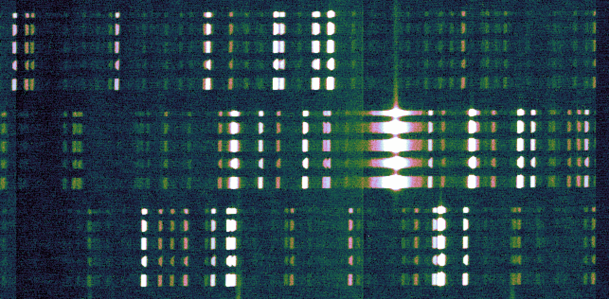
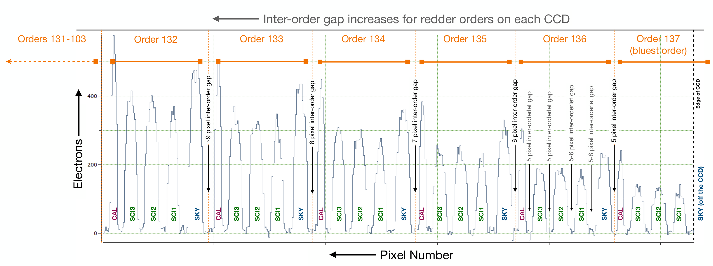

KPF DRP Algorithms
==================

Please refer to the `KPF-Pipeline GitHub Repository <https://github.com/Keck-DataReductionPipelines/KPF-Pipeline>`_
for any source code referred to below.

Overview
--------
The target audience here is astronomers who will use the data.
The description of each algorithm should include:

* a brief description of how the algorithm works
* performance estimates, if appropriate
* any caveats, if needed
* development status (if partially implemented or not yet implemented)

Current Limitations and Development Plans
^^^^^^^^^^^^^^^^^^^^^^^^^^^^^^^^^^^^^^^^^

<Add a list of current limitations and plans to address them>

Include:

* Doppler stability on timescales longer than 1 day
* consistency of wavelength solutions
* intranight drift corrections for wavelength solutions
* scattered light correction
* outlier rejection in spectral extraction
* sky subtraction
* telluric corrections
* Stellar activity indicators (see below)

Basics of CCD Raw Spectral Data
-----------------

A CCD (charged-coupled device) is a sensor of many pixels that allows
photons to be detected and a digital image to be produced.
The CCD is exposed to light for a certain amount of requested time,
called exposure time (e.g., EXPTIME in the FITS PRIMARY header, in seconds).
The light from a spectrometer is captured in a digital image by the spectrometer CCD,
and this image is called a raw 2D echellogram.
In the case of KPF, spectroscopic-image data are taken by CCDs with GREEN and RED filters
(and a separate CCD with a Ca H&K line filter),
and these are exposed simultaneously via a beamsplitter.
The raw spectral data from a single exposure is formatted into
is a single computer data file in standardized, multi-extension FITS format.
There are multiple extensions to contain the 2D image data from different amplifiers and filters.
This is called an L0 FITS file.   A example filename is ``KP.20221203.81416.24.fits``,
which is an arclamp calibration exposure, and it includes the observation date and time.

Generally, the spectral wavelength covered in the data extended from the blue portion
of the spectral range at bottom of the image to the red portion of the spectral range
at the top of the image.  The spectral wavelength also increases monotonically from
left to right in the image.  Light from a given instrument fiber-optic cable will show up in the image
as a slightly curved horizontal swath of 10 or 20 pixels in width that covers much of the
image from left to right, called an 'orderlet trace', which will appear to repeat vertically in the image
as different spectral wavelength ranges are traversed and detected (but with independent spectral data
content), an effect of the diffraction grating and optics that direct how
light is spread out onto the CCD by different diffraction orders.
Thus, a given order trace will have a wavelength range that somewhat overlaps
those of the neighboring order traces below and above.
This complexity makes the reduction of 2D raw spectra data particularly challenging.

The following figure is a subimage of the aforementioned arclamp exposure from the ``GREEN-AMP1``
FITS extension near the right side of the CCD associated with the corresponding readout amplifier.

This subimage is about 500 pixels wide.
It shows portions of three sets of order traces horizontally oriented,
where each order trace is composed of 5 distinct orderlets from top to bottom in the subimage
made by the ``CAL``, ``SCI3``, ``SCI2``, ``SCI1``, and ``SKY`` fibers of the instrument.
Atomic lines from the arc lamp are clearly visible in the orderlets.

This is illustrated more clearly in the following diagram, which shows spectral orders
and the arrangement of orderlets within each order.
The horizontal axis in the diagram is actually the vertical axis of a CCD spectral data image, and the
left arrow beside the Pixel Number label on the horizontal axis points toward the top of the image.

The order numbers in the diagram are spectral order numbers that obey the grating equation
(and not array indices that start at zero).
The orderlet ordering is ``CAL``, ``SCI3``, ``SCI2``, ``SCI1``, and ``SKY``,
starting at the top of the 2D spectral data image,
as is usual for viewing images, with redder orders above and bluer orders below.
Note that in the bluest order (at the right edge of the diagram or bottom of the 2D spectral data image)
the SKY trace partially falls off of the active area of the CCD, so it is not shown in the above diagram.

CCD Image Processing
--------------------

The CCD image processing consists of several steps, as discussed below.
It starts with an L0 FITS file for a given exposure and ends with a 2D FITS file.
The L0 FITS file contains several HDUs (header-data units) with CCD subimage data from
separate readout amplifiers.
The size in pixels of the subimages depends on the mode in which the instrument operating,
which may be utilizing 2 or 4 amplifiers for a given GREEN or RED filter.
For example, with 2 amplifiers the subimage is 2094x4110 pixels.
The description in this section mainly refers to the GREEN and RED CCDs.

Here are the basic image-processing steps for a given L0 FITS file:

1. Overscan subtraction
2. Mosaicing amplifier subimage data into a full image.
3. Master bias subtraction
4. Master dark subtraction
5. Master flat correction
6. Quality control testing
7. Production of a 2D FITS file for the exposure

Overscan subtraction is a fundamental data-reduction step in CCD image processing.
It is the removal of the bias in the data that is associated
with signal from pixels that are not exposed to light.  By design, the edges of a CCD are masked
off so that there is no light exposure, and so sensor data from these overscan regions
(or so-called bias strips) can be used to compute the overscan bias.
Overscan subtraction is also known as "floating-bias subtraction", which is not to be confused with the
master bias subtraction to be discussed below.
The method of determining the overscan bias is, for a given readout amplifier, to compute the clipped mean of data
well into the overscan strip, avoiding the 4-pixel pre-scan region, with an addition 5-pixel buffer away from
the edges of the overscan strip.  The specific clipped-mean algorithm involves rejecting data that are
+/- some number of sigmas from the median of the data, where sigma is robustly computed by::

    sigma = 0.5 * (p84 - p16)
    p84 = 84th percentile of the data
    p16 = 16th percentile of the data

The mean or average is computed from the remaining data.
The level of data clipping is 2.1 sigma.
The overscan bias, which is just a number for each readout amplifier (for a given filter), is then subtracted from
the image data at each pixel in the unmasked or light-exposed portion of the CCD subimage data for that
readout amplifier.
The CCD subimage is trimmed to completely remove the bias strips that are now superfluous.
With the overscan bias removed, the CCD subimage data are a step closer to a regime that is
linearly proportional to the amount of light exposure.  The python module ``overscan_subtract.py``
under git repository ``KPF-Pipeline/modules/Utils`` handles both overscan subtraction and
mosaicing amplifier subimage data into a full image.  This module is called from subrecipe
``watchfor_kpf_l0.recipe`` of the KPF data reduction pipeline ``kpf_drp.recipe``
under git repository ``KPF-Pipeline/recipes``.  The ``WATCHFOR_L0`` block in configuration file
``kpf_drp.cfg`` under git repository ``KPF-Pipeline/configs`` gives the parameter settings used.

The mosaicing of subimages from different readout amplifiers into a full CCD image for a given filter (GREEN or RED)
is straightforward.  The relative positions of the subimages are described in the following parameter files under
git repository ``KPF-Pipeline/static``: ``kpfsim_ccd_orient_green.txt`` and ``kpfsim_ccd_orient_red.txt``.
At this point the product is in 2D FITS format, but the actual 2D FITS file is not actually written to disk
until after all the remaining CCD image processing has been done, which is described in the remainder of this section.

Next is master bias subtraction.  This is done in machine memory, continued after the aforementioned steps.
Whereas overscan subtraction involves subtracting off the floating bias specific to an exposure
(and readout amplifier), master bias subtraction involves the pixel-by-pixel subtraction of a
master bias image that is common to a collection of
exposures taken within some short period of time (such as 24 hours).  The master bias is a data-clipped,
pixel-by-pixel stack average of some number of bias frames that were taken in the near vicinity of time.
A database query is performed to obtain the nearest-in-time available master bias 2D FITS file (past or future).
The section below called **Master Files Creation** gives more details about the generation of master bias files.
FITS keyword ``BIASDONE = 1`` is written to the FITS header to signify that master bias subtraction was done.
If the input image is itself a bias exposure, then the pipeline does not perform master bias subtraction and
FITS keyword ``BIASDONE = 0`` will be written to the FITS header.
Regardless, the path and filename of the master bias file that was applied or would have been applied is
written to FITS keywords ``BIASDIR`` and ``BIASFILE``, respectively.

Master dark subtraction is done next, also in machine memory.  Dark current contributes electrons to the signal
of a pixel in proportion to time, and must be removed from the desired photon-detection signal.
From the input image to be processed,
master dark subtraction involves involves the pixel-by-pixel subtraction of a
master dark image, in electrons per second, multiplied by the exposure time of the input image.
The master dark is a data-clipped, pixel-by-pixel stack average of some number of dark frames,
normalized by their exposure times, that were taken in the near vicinity of time.
A database query is performed to obtain the nearest-in-time available master dark 2D FITS file.
The section below called **Master Files Creation** gives more details about the generation of master dark files.
FITS keyword ``DARKDONE = 1`` is written to the FITS header to signify that master dark subtraction was done.
If the input image is itself a bias or dark exposure, then the pipeline does not perform master dark subtraction and
FITS keyword ``DARKDONE = 0`` will be written to the FITS header.
Regardless, the path and filename of the master dark file that was applied or would have been applied is
written to FITS keywords ``DARKDIR`` and ``DARKFILE``, respectively.

Master flat correction is done next, also in machine memory.
This is also known as the image nonuniformity correction,
and it corrects for pixel-to-pixel variations in detector responsivity.
The input image is simply divided by the master flat.
The master flat is a data-clipped,
pixel-by-pixel stack average of some number of Flatlamp frames that were taken in the near vicinity of time.
A database query is performed to obtain the nearest-in-time available master flat 2D FITS file.
The section below called **Master Files Creation** gives more details about the generation of master flat files.
FITS keyword ``FLATDONE = 1`` is written to the FITS header to signify that master flat correction was done.
If the input image is itself a bias or dark exposure, then the pipeline does not perform master flat correction and
FITS keyword ``FLATDONE = 0`` will be written to the FITS header.
Regardless, the path and filename of the master flat file that was applied or would have been applied is
written to FITS keywords ``FLATDIR`` and ``FLATFILE``, respectively.

Quality control testing is also done. Below is a fairly complete example of all the FITS keywords that
are written to the PRIMARY header after successfully CCD image processing, with helpful keyword comments::

    EXTNAME = 'PRIMARY '           / extension name
    NOTJUNK =                    1 / QC: Not in list of junk files
    DATAPRL0=                    1 / QC: L0 data present
    KWRDPRL0=                    1 / QC: L0 keywords present
    TIMCHKL0=                    1 / QC: L0 times consistent
    ISGOOD  =                    1 / QC: all other QC tests passed
    REDAMPS =                    2
    GRNAMPS =                    2
    BIASFILE= 'kpf_20250113_master_bias_autocal-bias.fits'
    BIASDIR = '/masters/20250113'
    BIASDONE=                    1
    DARKFILE= 'kpf_20250113_master_dark_autocal-dark.fits'
    DARKDIR = '/masters/20250113'
    DARKDONE=                    1
    FLATFILE= 'kpf_20250113_master_flat.fits'
    FLATDIR = '/masters/20250113'
    FLATDONE=                    1
    GR2DF99P=             11089.16 / 99th percentile flux in 2D Green image (e-)
    GR2DF90P=              1770.91 / 90th percentile flux in 2D Green image (e-)
    GR2DF50P=                60.21 / 50th percentile flux in 2D Green image (e-)
    GR2DF10P=                -1.25 / 10th percentile flux in 2D Green image (e-)
    RD2DF99P=             13191.65 / 99th percentile flux in 2D Red image (e-)
    RD2DF90P=              1077.75 / 90th percentile flux in 2D Red image (e-)
    RD2DF50P=                 42.7 / 50th percentile flux in 2D Red image (e-)
    RD2DF10P=                -10.6 / 10th percentile flux in 2D Red image (e-)
    HK2DF99P=                 3.14 / 99th percentile flux in 2D CaHK image
    HK2DF90P=                 1.85 / 90th percentile flux in 2D CaHK image
    HK2DF50P=                 0.25 / 50th percentile flux in 2D CaHK image
    HK2DF10P=                -1.32 / 10th percentile flux in 2D CaHK image
    DATAPR2D=                    1 / QC: 2D red and green data present check
    DBRID   =              1239221 / DB raw image ID
    L0QCBITS=                   64 / L0 QC bitwise flags (see defs below)
    MEDGRN1 =           39474412.0 / Median for GREEN_AMP1 [DN]
    MEDGRN2 =           35158804.0 / Median for GREEN_AMP2 [DN]
    MEDRED1 =           36648488.0 / Median for RED_AMP1 [DN]
    MEDRED2 =           36021800.0 / Median for RED_AMP2 [DN]
    MEDCAHK =                302.0 / Median for CA_HK_AMP [DN]
    P16GRN1 =           38943508.0 / 16th percentile for GREEN_AMP1 [DN]
    P16GRN2 =           34463428.0 / 16th percentile for GREEN_AMP2 [DN]
    P16RED1 =           36180284.0 / 16th percentile for RED_AMP1 [DN]
    P16RED2 =           35437960.0 / 16th percentile for RED_AMP2 [DN]
    P16CAHK =                301.0 / 16th percentile for CA_HK_AMP [DN]
    P84GRN1 =           45165332.0 / 84th percentile for GREEN_AMP1 [DN]
    P84GRN2 =           45947276.0 / 84th percentile for GREEN_AMP2 [DN]
    P84RED1 =           39188952.0 / 84th percentile for RED_AMP1 [DN]
    P84RED2 =           40671076.0 / 84th percentile for RED_AMP2 [DN]
    P84CAHK =                304.0 / 84th percentile for CA_HK_AMP [DN]
    L0BIT00 = 'GREEN_AMP1 Dead: gt 5% of pixels have values lt 10000 D.N.'
    L0BIT01 = 'GREEN_AMP2 Dead: gt 5% of pixels have values lt 10000 D.N.'
    L0BIT02 = 'GREEN_AMP3 Dead: gt 5% of pixels have values lt 10000 D.N.'
    L0BIT03 = 'GREEN_AMP4 Dead: gt 5% of pixels have values lt 10000 D.N.'
    L0BIT04 = 'RED_AMP1 Dead: gt 5% of pixels have values lt 10000 D.N.'
    L0BIT05 = 'RED_AMP2 Dead: gt 5% of pixels have values lt 10000 D.N.'
    L0BIT06 = 'CA_HK: gt 5% of pixels have values lt 10000 D.N.'
    L0BIT07 = 'GREEN_AMP1 Saturated: gt 15% of pixels have values gt 5.0e8 D.N.'
    L0BIT08 = 'GREEN_AMP2 Saturated: gt 15% of pixels have values gt 5.0e8 D.N.'
    L0BIT09 = 'GREEN_AMP3 Saturated: gt 15% of pixels have values gt 5.0e8 D.N.'
    L0BIT10 = 'GREEN_AMP4 Saturated: gt 15% of pixels have values gt 5.0e8 D.N.'
    L0BIT11 = 'RED_AMP1 Saturated: gt 15% of pixels have values gt 5.0e8 D.N.'
    L0BIT12 = 'RED_AMP2 Saturated: gt 15% of pixels have values gt 5.0e8 D.N.'
    L0BIT13 = 'CA_HK Saturated: gt 15% of pixels have values gt 5.0e8 D.N.'
    RNGREEN1=             23.32865 / Instantaneous GREEN_AMP1 read noise [electrons]
    RNGREEN2=             23.73995 / Instantaneous GREEN_AMP2 read noise [electrons]
    RNRED1  =             24.74892 / Instantaneous RED_AMP1 read noise [electrons]
    RNRED2  =             26.11677 / Instantaneous RED_AMP2 read noise [electrons]
    RNCAHK  =                  0.0 / Instantaneous CA_HK read noise [electrons]
    GREENTRT=               46.909 / GREEN chip total read time [seconds]
    REDTRT  =               46.843 / RED chip total read time [seconds]
    READSPED= 'regular '           / Categorization of read speed

In the end, the 2D FITS file is written to the filesystem,
containing HDUs for GREEN and RED full spectroscopic-data images,
each 4080x4080 pixels, with FITS extension names GREEN_CCD and RED_CCD, respectively.
The overscan biases that were subtracted are recorded in the FITS headers of
these HDUs (not PRIMARY HDU); for example::

    OSCANV1 =    3086.385215099043 / Overscan clipped mean (e-), GREEN_AMP1
    OSCANV2 =    2783.307279684444 / Overscan clipped mean (e-), GREEN_AMP2

The physical units of the image data is electrons.
There are also associated variance images with FITS extension names
GREEN_VAR and RED_VAR, respectively, with physical units of electrons squared.

Master Files Creation
---------------------

<TBD to add content here>

Include a description of how master stacks are made for bias, dark, flats, LFC, etalon, and ThAr.

Scattered light correction
--------------------------

<TBD to add content here>

Spectral Extraction
-------------------

<TBD to add content here>

Sky Correction (not yet implemented)
------------------------------------

<TBD to add content here>

Wavelength Calibration
----------------------

<TBD to add content here>

Barycentric Correction
----------------------

<TBD to add content here>

Telluric Model (not yet implemented)
------------------------------------

<TBD to add content here>

Cross-Correlation based RVs
---------------------------

<TBD to add content here>

Include a note about RV header information

Stellar Activity Information
----------------------------
KPF does not yet have stellar activity indicators produced as a standard data product from the DRP.  The Ca H & K spectrometer covers the Ca H & K lines and we expect the DRP to produce S-values on the Mt. Wilson scale.  Future DRP developments are also expected to include code to generate other activity indicators (Ca IR triplet, Hα, etc.)

Ca H&K Spectrometer Data Processing
-----------------------------------

<TBD to add content here>

Exposure Meter Data Processing
------------------------------

<TBD to add content here>

Quality Control
---------------

<TBD to add content here>

Explain how the QC framework operates and describe the current status.

Guider Data Processing
----------------------
The DRP does not further process the data from the KPF Guider that are stored in FITS extensions in the L0 files.  These data include a guider image summed over the spectrometer integration and a table of guiding corrections, flux measurements, and other diagnostics taken from real-time Source Extractor analysis of the guider frames (typically at 100 Hz speed).

